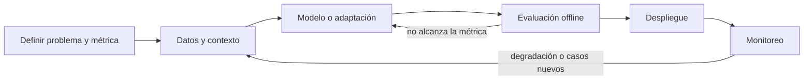

## Concepto

Un sistema de IA no se termina al desplegarlo. Los datos del mundo real
cambian, los usuarios encuentran casos no previstos y los proveedores
actualizan sus modelos. Por eso el ciclo de vida es un **bucle**: lo que se
observa en producción alimenta la siguiente iteración.

## Cómo funciona

1. **Definir el problema y la métrica.** Qué decisión o tarea automatiza el
   sistema, qué cuenta como éxito y cuánto cuesta un error. El entregable es
   un documento con la métrica y el umbral de aceptación.
2. **Datos y contexto.** Reunir, limpiar y validar los datos. En un modelo
   propio son los datos de entrenamiento; en una aplicación con LLM son los
   documentos y registros que el modelo recibirá como contexto, además del
   conjunto de evaluación.
3. **Modelo o adaptación.** Entrenar un modelo o adaptar uno existente con
   prompts, recuperación de contexto o fine-tuning. Se empieza por la opción
   más simple que pueda cumplir la métrica.
4. **Evaluación offline.** Medir contra el conjunto de evaluación antes de
   exponer el sistema a usuarios. Si no alcanza el umbral, se vuelve a la
   etapa anterior.
5. **Despliegue.** Publicar con control: versiones, un despliegue gradual y
   la posibilidad de volver atrás.
6. **Monitoreo.** Observar la calidad, la latencia, el costo y la
   distribución de las entradas. La degradación por cambios en los datos se
   llama *drift* y es la razón principal para cerrar el bucle.

## En AI Engineering

El ciclo cambia de forma según el tipo de sistema. En Machine Learning
clásico, la etapa 3 (entrenar) domina el esfuerzo y el monitoreo vigila el
drift de las variables de entrada. En una aplicación basada en un modelo
fundacional, la etapa 3 suele ser corta (prompts y contexto) y el esfuerzo se
desplaza a la etapa 2 (qué contexto recuperar) y a la 4 (cómo evaluar
respuestas abiertas). Además aparece un riesgo propio: el proveedor puede
actualizar el modelo y cambiar el comportamiento sin que tú cambies una línea
de código. Por eso la evaluación debe poder ejecutarse de forma automática en
cada cambio de versión.

> [!IMPORTANT]
> Versiona todo lo que afecta al comportamiento: código, prompts, versión del
> modelo, datos de evaluación y configuración de recuperación. Si no puedes
> reproducir un resultado, no puedes depurarlo.

## Práctica

Toma el caso que definiste en la lección anterior y dibuja su ciclo de vida:
para cada etapa, escribe el entregable, quién es responsable y qué señal de
monitoreo te haría volver a una etapa anterior. Identifica cuál de las seis
etapas es la más riesgosa en tu caso y por qué.
