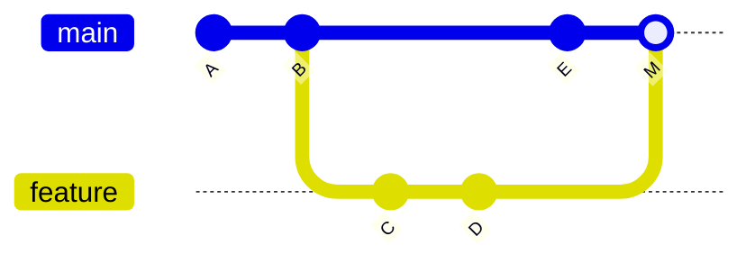

## Concepto

Una rama en Git no es una copia de archivos: es un **puntero móvil a un
commit**. Crear una rama cuesta lo mismo que escribir un hash en un archivo.
`HEAD` indica en qué rama estás; cada commit nuevo avanza el puntero de esa
rama.



## Cómo funciona

Hay tres formas de integrar una rama en otra:

- **Fast-forward.** Si la rama destino no avanzó desde que se creó la rama,
  Git solo mueve el puntero. No se crea un commit nuevo.
- **Merge de tres vías.** Si ambas ramas avanzaron, Git combina los cambios
  desde el ancestro común y crea un *merge commit* con dos padres (el commit
  `M` del diagrama). La historia conserva exactamente lo que pasó.
- **Rebase.** Reaplica los commits de tu rama sobre la punta de otra. El
  resultado es una historia lineal, pero **los commits son nuevos**: tienen
  otros hashes, aunque su contenido sea el mismo.

```bash
git switch -c feature/chunking   # crea la rama y se mueve a ella
git switch main
git merge feature/chunking       # integra con merge
git switch feature/chunking
git rebase main                  # reaplica tu trabajo sobre main
git rebase -i HEAD~3             # reordena, une o edita tus últimos 3 commits
```

Cuando dos ramas modifican las mismas líneas, Git marca un **conflicto** en
el archivo. Se resuelve editando el archivo, eligiendo o combinando las
versiones, y confirmando con `git add` y luego `git commit` (en un merge) o
`git rebase --continue` (en un rebase).

## Errores comunes

- **Hacer rebase de commits que otros ya descargaron.** Como el rebase crea
  commits nuevos, obliga a los demás a reconciliar historias distintas. La
  regla es: rebase solo sobre commits que únicamente existen en tu máquina o
  en tu rama personal.
- Resolver un conflicto quedándose con "mi versión" sin leer la otra, y
  perder el cambio de un compañero.
- Ramas que viven semanas sin integrarse: cuanto más divergen, más costosos
  son los conflictos.

## En AI Engineering

Los experimentos se prestan a ramas cortas: una rama para probar otra
estrategia de chunking, otra para cambiar el prompt del sistema. Cada rama
debe incluir el resultado de la evaluación que justifica integrarla. Antes de
abrir el pull request, un `git rebase -i` para limpiar los commits de prueba
("intento 3", "ahora sí") deja una historia que explica qué cambió y por qué.

## Práctica

En un repositorio de prueba, crea dos ramas desde `main` que modifiquen la
misma línea de un archivo. Integra la primera con merge y la segunda con
rebase, y resuelve el conflicto. Compara las dos historias con
`git log --oneline --graph --all` y escribe en tres líneas cuándo elegirías
cada estrategia.
