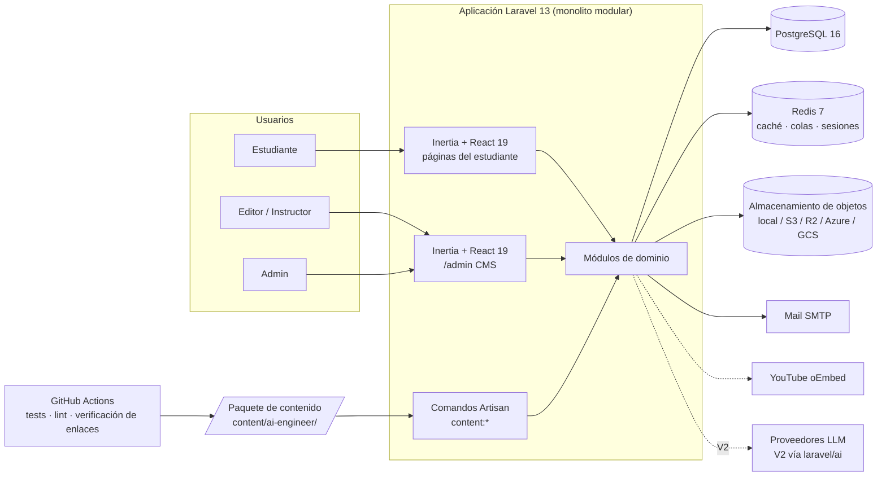
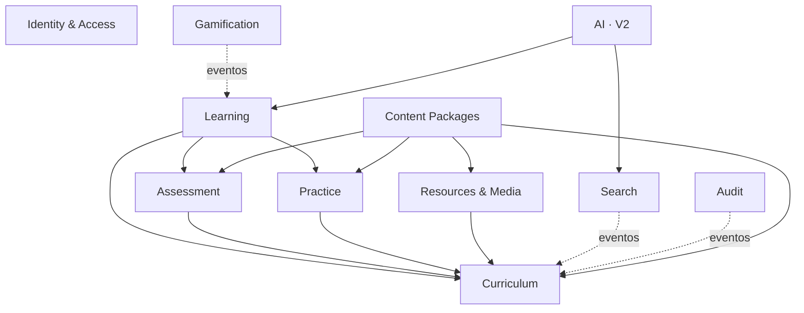
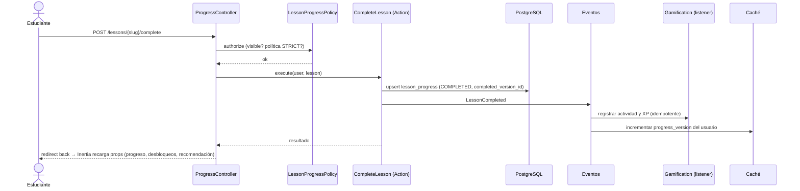
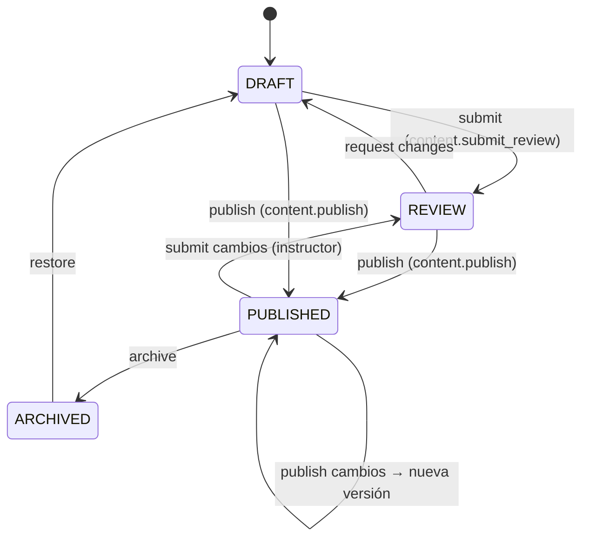

# Arquitectura

| | |
|---|---|
| Estado | v1.0: diseño aprobado para la Fase 3 |
| Fecha | 2026-09-25 |
| Relacionados | [database](database.md) · [frontend-architecture](frontend-architecture.md) · [content-architecture](content-architecture.md) · [product-discovery](product-discovery.md) |

---

## 1. Resumen

Es un **monolito modular** en Laravel 13 que sirve una SPA React 19 a través de Inertia 3, sin una API REST intermedia. PostgreSQL 16 es la única base de datos y Redis aporta caché, colas y sesiones. El sistema se divide en **módulos de dominio** con dependencias explícitas.

El contenido educativo es **dato**: se administra desde el CMS y se inicializa con un **paquete de contenido** importable.

**Por qué un monolito [O]:** el equipo es pequeño, no hay clientes externos en V1, y así se obtienen autenticación, sesiones, CSRF, autorización y validación del framework sin duplicarlas en una API. Si aparece un cliente móvil o una API pública, se añade Sanctum y endpoints versionados sobre las mismas Actions, sin reescribir el dominio.

## 2. Contexto del sistema



## 3. Stack (verificado el 2026-09-25)

| Capa | Tecnología | Versión | Nota |
|---|---|---|---|
| Lenguaje backend | PHP | 8.4 | Pest 5 exige ≥ 8.4 |
| Framework | Laravel | 13.x | |
| Autenticación | Laravel Fortify (vía starter kit) | 1.40 | Login, registro, verificación, 2FA, passkeys |
| Puente | Inertia.js | 3.x (Laravel 3.4 / React 3.7) | |
| Frontend | React + TypeScript | 19.x / 5.x | La versión de TypeScript la fija el starter kit |
| Rutas tipadas | Laravel Wayfinder | 0.1.x | Funciones TS generadas desde las rutas de Laravel |
| Estilos | Tailwind CSS | 4.x | |
| Componentes | shadcn/ui (Radix) | — | Copiados en `components/ui`, no son una dependencia |
| Editor de contenido | TipTap (ProseMirror) | 3.31 | Editor enriquecido del CMS (ADR-023) |
| Toolchain JS | Vite 8 + vite-plus (oxlint, oxfmt, Vitest) | 8.x / 0.3 | Viene del starter kit oficial |
| Tipografía | @fontsource-variable (Instrument Sans, JetBrains Mono) | 5.3 | Autoalojada (ADR-025) |
| Lector de contenido | Shiki (core + motor JS) · KaTeX · Mermaid · @tailwindcss/typography | 4.4 · 0.16 · 12.0 · 0.5 | Carga diferida por uso. KaTeX fijado en 0.16 para compartir copia con Mermaid (ADR-028) |
| Grafo | @xyflow/react + @dagrejs/dagre | 12.x / 3.x | |
| Base de datos | PostgreSQL | 16 | Extensiones: `pg_trgm`, `unaccent`, `citext`. `pgvector` en V2 |
| Caché / colas / sesiones | Redis | 7 | |
| Permisos | spatie/laravel-permission | 8.x | |
| Tests backend | Pest (sobre PHPUnit 13) + plugin browser | 5.2 | E2E sobre Playwright (plugin en la Fase 5) |
| Tests frontend | Vitest (incluido en vite-plus) + React Testing Library | 4.1 / 16.x | |
| Análisis estático | Larastan (PHPStan), Pint, oxlint, `tsc` | | |
| IA (V2) | laravel/ai | 1.x | SDK oficial multiproveedor |
| Infraestructura local | Docker Compose (solo infraestructura) | | Validación pendiente: el entorno actual no tiene daemon |
| CI/CD | GitHub Actions | | Servicios Postgres 16 y Redis 7 |

## 4. Módulos de dominio

Cada módulo tiene su propio espacio de nombres y expone Actions (casos de uso), servicios de consulta y eventos. Los modelos Eloquent viven en `app/Models`: son persistencia compartida y la convención de Laravel.

| Módulo | Responsabilidad | Fase |
|---|---|---|
| **Identity & Access** | Usuarios, roles, permisos, perfil, preferencias (locale, zona horaria) | 3–5 |
| **Curriculum** | Roadmaps, tracks, módulos, lecciones, skills y dependencias; flujo de publicación; versionado; validación de DAG | 3–5 |
| **Learning** | Progreso del estudiante, resolución de estados (LOCKED…MASTERED), cálculo de progreso por track y skill, recomendaciones | 5 |
| **Resources & Media** | Recursos externos, videos, verificación de enlaces, subidas de archivos | 5 (recursos), 6 |
| **Assessment** | Motor de tipos de pregunta, quizzes, ejercicios, calificación e intentos | 6 |
| **Practice** | Laboratorios, proyectos, milestones y entregas | 6 |
| **Gamification** | Actividad, XP, rachas, insignias y certificados | 7 |
| **Search** | Índice `search_documents` y consultas | 7 |
| **Content Packages** | Validar, importar y exportar paquetes de contenido | 3–5 |
| **Audit** | Registro inmutable de cambios y acciones administrativas | 3–5 |
| **AI** (V2) | Tutor, revisor y recomendador IA sobre `laravel/ai` | V2 |



Regla: las flechas sólidas son llamadas directas permitidas y las punteadas son reacciones a **eventos de dominio**. Gamification, Search y Audit nunca son invocados directamente por Curriculum o Learning, así que se pueden desactivar o cambiar sin tocar el núcleo.

## 5. Estructura de directorios (backend)

```text
app/
├── Models/                      # Eloquent: persistencia, relaciones, scopes, casts. Sin lógica de negocio compleja
├── Enums/                       # Enums PHP con backing: fuente de verdad de estados y tipos (se exportan a TS)
├── Domain/
│   ├── Curriculum/
│   │   ├── Actions/             # PublishLesson, SubmitForReview, ArchiveContent, SyncLessonDependencies…
│   │   ├── Graph/               # DependencyGraph (detección de ciclos, orden topológico)
│   │   ├── Publishing/          # PublishReadiness (checklist de publicación), LessonVersioner
│   │   └── Events/              # ContentPublished, ContentUnpublished…
│   ├── Learning/
│   │   ├── Actions/             # StartLesson, CompleteLesson, UncompleteLesson
│   │   ├── State/               # RoadmapStateResolver, NodeState, TrackProgress, SkillProgressCalculator
│   │   ├── Recommendations/     # RecommendationEngine (interfaz), RuleBasedRecommendationEngine, Rules/*
│   │   └── Events/              # LessonStarted, LessonCompleted, LessonMastered…
│   ├── Assessment/              # QuestionTypes/* (strategy), QuizGrader, ExerciseEvaluator (Fase 6)
│   ├── Practice/                # Labs, Projects (Fase 6)
│   ├── Gamification/            # ActivityRecorder, XpLedger, StreakCalculator, BadgeRules/* (Fase 7)
│   ├── Search/                  # SearchIndex (interfaz), PostgresSearchIndex (Fase 7)
│   ├── Content/                 # Package/ (reader, validator, importer), Links/ (LinkChecker)
│   │   └── RichContent/         # Documento estructurado: esquema, validador, texto plano, Markdown → RichContent
│   ├── Audit/                   # AuditLogger, observers
│   └── Ai/                      # V2
├── Http/
│   ├── Controllers/
│   │   ├── Learn/               # Dashboard, Roadmap, Track, Lesson, Skill, Progress
│   │   ├── Admin/               # CRUD por recurso y transiciones de estado
│   │   └── Settings/            # Del starter kit
│   ├── Requests/                # FormRequests: toda escritura se valida aquí
│   ├── Resources/               # JsonResource: contrato de props para Inertia (no se envían modelos crudos)
│   └── Middleware/
├── Policies/                    # Una policy por modelo administrable; se aceptan usuarios invitados (?User)
├── Console/Commands/            # content:validate, content:import, content:export, content:verify-links, types:enums
└── Providers/
content/                          # Paquete(s) de contenido: datos, NO código de la app
```

### Patrones adoptados [O]

- **Actions** (clases de un solo caso de uso, invocables y testeables). El controlador valida (FormRequest), autoriza (Policy), invoca la Action y devuelve la respuesta Inertia. No hay lógica de negocio en controladores ni en componentes React.
- **Sin repositorios sobre Eloquent.** En Laravel añaden indirección sin beneficio. Las lecturas complejas van en *query objects* (`RoadmapGraphQuery`, `UserProgressQuery`).
- **Eventos de dominio síncronos por defecto.** Las reacciones pesadas (verificación de enlaces, insignias, reindexación) se marcan con `ShouldQueue` y van a Redis.
- **Enums PHP como fuente de verdad.** `php artisan types:enums` genera `resources/js/types/enums.ts`. Es un comando propio pequeño; evita añadir `spatie/laravel-data` y `typescript-transformer` solo para esto.
- **Morph map forzado** (`Relation::enforceMorphMap`) con alias cortos (`lesson`, `track`, `skill`, `project`…). La BD nunca guarda nombres de clase PHP.
- **Prevención de lazy loading** fuera de producción (`Model::preventLazyLoading()`) para atrapar consultas N+1 en los tests.

## 6. Motor de progreso y desbloqueo

Es el corazón funcional. Diseño en detalle:

### Qué se persiste y qué se calcula

| Dato | Persistido | Calculado |
|---|---|---|
| Lección IN_PROGRESS / COMPLETED / MASTERED | `lesson_progress.status` | |
| Lección LOCKED / AVAILABLE | | A partir de las dependencias y del desbloqueo del track |
| Progreso del track (%) | | Lecciones completadas / lecciones publicadas del track |
| Estado del track | | Por reglas (abajo) |
| Progreso de la skill (%) | | Promedio ponderado (`lesson_skill.weight`) de las lecciones que la desarrollan |
| Estado de la skill | | Por umbral y prerequisitos de skill |
| Hitos (skill dominada, track completado) | `learning_activities` | Se detectan al cruzar el umbral |

**[O] Por qué no se materializa el progreso de track ni de skill (ADR-020):** al publicar una lección nueva, cualquier porcentaje guardado queda desactualizado para todos los usuarios. Calcularlo desde `lesson_progress` (una sola consulta agregada e indexada) es correcto por construcción. Se cachea por usuario y por versión del contenido.

### Reglas de estado

```text
Lección (L) del track (T):
  si existe lesson_progress           → su status (IN_PROGRESS | COMPLETED | MASTERED)
  si no, si T desbloqueado ∧ todas las dependencias REQUIRED de L están COMPLETED+ → AVAILABLE
  si no                               → LOCKED

Track T desbloqueado ⇔ ∀ dependencia REQUIRED (P → T, min_progress m): progreso(P) ≥ m

Track T:
  MASTERED    ⇔ 100 % completado ∧ todos los quizzes publicados del track aprobados ∧ (T sin proyectos ∨ ≥1 proyecto del track COMPLETED)
  COMPLETED   ⇔ 100 % de lecciones publicadas completadas
  IN_PROGRESS ⇔ alguna lección con progreso
  AVAILABLE   ⇔ desbloqueado
  LOCKED      ⇔ en otro caso

Lección MASTERED ⇔ COMPLETED ∧ quiz de la lección aprobado con score ≥ mastery_threshold (90 % por defecto)
  (una lección sin quiz llega como máximo a COMPLETED: MASTERED exige evidencia)

Skill S: progreso = Σ weight(L)·[L ≥ COMPLETED] / Σ weight(L), sobre las lecciones publicadas que desarrollan S
  MASTERED    ⇔ progreso = 100 ∧ toda lección de S que tenga quiz está MASTERED
  AVAILABLE   ⇔ ∀ dependencia REQUIRED de skill (P, m): progreso(P) ≥ m
```

El desbloqueo de un track depende del **progreso** de sus prerequisitos, no de su *estado de desbloqueo*. Por eso el cálculo no es recursivo: una sola pasada O(V+E).

### Política de desbloqueo (ADR-009)

- **ADVISORY** (por defecto): el contenido LOCKED se puede abrir y completar. La UI muestra el estado y el aviso: *"Antes de continuar, completa Python Fundamentals (llevas 45 %, se requiere 80 %)"*.
- **STRICT**: las acciones de progreso sobre contenido LOCKED devuelven 403 (lo aplica la Policy, no solo la UI). La lectura sigue permitida para no esconder qué viene después.

### Flujo al completar una lección



### Caché

| Clave | Contenido | Invalidación |
|---|---|---|
| `roadmap-graph:{roadmap}:{content_version}` | Tracks, módulos y lecciones publicadas con sus dependencias | `content_version` global que se incrementa en cada publicación, despublicación o cambio de dependencias. Las claves viejas expiran solas |
| `roadmap-state:{user}:{progress_version}:{content_version}` | Estados y porcentajes calculados | `progress_version` por usuario, incrementado en cada escritura de progreso |

Se versionan las claves en lugar de borrarlas, así que no hay invalidaciones olvidadas.

## 7. Publicación y versionado



- **Lecciones:** la fila de `lessons` es la *copia de trabajo* editable. Al publicar se crea un **snapshot inmutable** en `lesson_versions` y `lessons.published_version_id` apunta a él. El estudiante **siempre lee la versión publicada**, así que editar una lección publicada no filtra borradores. La UI del editor muestra "Cambios sin publicar" cuando el hash de la copia de trabajo difiere del de la versión publicada.
- **Visibilidad de una lección para el estudiante:** `published_version_id IS NOT NULL ∧ status ≠ ARCHIVED ∧ módulo y track PUBLISHED`. Una lección publicada en REVIEW (cambios pendientes) sigue mostrando su versión anterior.
- **Resto de entidades** (track, módulo, skill, quiz, proyecto…): tienen estado pero no versiones. Son visibles si están PUBLISHED y sus ediciones son inmediatas. Es una limitación documentada (R10).
- **Checklist de publicación (`PublishReadiness`):** antes de publicar, el backend valida el contrato pedagógico (ver [content-architecture §3](content-architecture.md#3-contrato-pedagógico)). El editor muestra ese checklist en vivo, así que el editor sabe qué falta antes de pulsar Publicar.
- **Borrado:** el contenido con progreso de estudiantes no se borra; se archiva. Lo garantiza la BD con FK `RESTRICT` desde `lesson_progress`. Solo se borra físicamente el contenido DRAFT que nunca se publicó.

## 8. Recomendaciones

Interfaz `RecommendationEngine::recommend(User, Roadmap, int $limit): Recommendation[]`. Cada `Recommendation` lleva `{type, subject, reasonKey, reasonParams, priority}`; la razón se traduce con i18n, no se guarda como texto.

Reglas deterministas de V1, evaluadas en orden (cada regla es una clase):

1. **Continuar**: la lección IN_PROGRESS vista más recientemente.
2. **Siguiente en el track**: la primera lección AVAILABLE, por posición, en el track de la última actividad.
3. **Desbloquear**: si el siguiente track natural está LOCKED, se recomienda el prerequisito incumplido con el mensaje "Antes de continuar, completa {track} (llevas {x} %, se requiere {y} %)".
4. **Refuerzo** (V1.1): un quiz reprobado en los últimos 7 días lleva a repasar su lección.
5. **Proyecto** (V1.1): un track ≥ 80 % con un proyecto no iniciado lleva a sugerir ese proyecto.

En V2, `AiRecommendationEngine` implementa la misma interfaz y puede componerse con las reglas: las reglas filtran y la IA ordena y explica.

## 9. Búsqueda

- Tabla **`search_documents`** (tipo, id, título, resumen, cuerpo y un `tsvector` generado con pesos A/B/C), con índice GIN más trigramas en el título para tolerar errores de escritura.
- **Solo contiene contenido publicado, por construcción.** La alimentan los listeners de `ContentPublished` y `ContentUnpublished`. Buscar directamente en `lessons` filtraría borradores, porque la copia de trabajo vive ahí.
- Configuración de texto `es_unaccent` (stemmer español más `unaccent`), así que "regresion" encuentra "regresión".
- Interfaz `SearchIndex` con `PostgresSearchIndex`. Una implementación de OpenSearch o Meilisearch consumiría los mismos documentos.

## 10. Seguridad

| Amenaza / requisito | Control |
|---|---|
| Autenticación | Fortify: hash de contraseñas, verificación de email, 2FA TOTP y passkeys. Rate limit de login (`throttle`) |
| Autorización | Policy por modelo con permisos granulares (spatie). `/admin` exige `admin.access`. Las comprobaciones viven en el backend; la UI solo oculta |
| CSRF | Middleware de Laravel. Inertia envía el token automáticamente |
| XSS | El contenido enriquecido es un **documento estructurado (JSON), no HTML**. El servidor lo valida contra una lista blanca de nodos, marcas y atributos (`RichContentValidator`): esquemas de enlace permitidos, IDs de video por regex y límites de tamaño. El frontend renderiza **solo** los tipos de nodo conocidos con componentes React, sin `dangerouslySetInnerHTML`. Mermaid con `securityLevel: 'strict'`. Videos por proveedor e ID, **nunca con HTML de iframe guardado**. CSP en la Fase 8 |
| Asignación masiva | Solo `$request->validated()` llega a las Actions. `$fillable` explícito |
| Fuga de respuestas | Las preguntas se serializan **sin** la respuesta correcta; se califica en el servidor |
| Subidas (Fase 6) | Lista blanca de extensiones, MIME detectado con `finfo` (no el declarado), límites de tamaño, nombre aleatorio, disco privado, URLs temporales firmadas y reencodificación de imágenes con GD (elimina EXIF y payloads) |
| Rate limiting | Login, registro, envío de quiz o ejercicio, búsqueda, subidas y marcado de progreso |
| Auditoría | `audit_logs` de solo inserción: CRUD de contenido, transiciones de publicación, cambios de rol e importaciones |
| Secretos | Solo en `.env` (fuera de Git). `.env.example` sin valores reales |
| Privacidad | Perfil privado por defecto. El portfolio público es *opt-in*. Borrar la cuenta borra el progreso en cascada y anonimiza la auditoría (`user_id → NULL`) |

## 11. Almacenamiento y videos

- Toda operación de archivos usa **Laravel Filesystem** (Flysystem), que ya es la abstracción de almacenamiento: los discos `local`, `s3` (también sirve para Cloudflare R2 con un endpoint S3), Azure Blob y GCS son configuración, no código. No se escribe una abstracción propia.
- Tabla `videos` con `provider` (YOUTUBE, VIMEO, HOSTED), `external_id` para los externos y `storage_disk`/`storage_path` para los alojados. Un CHECK garantiza la coherencia. Los videos alojados se sirven con `Storage::temporaryUrl()`.
- Los metadatos de YouTube se obtienen por **oEmbed** (título, canal, miniatura) sin clave de API. La duración no viene en oEmbed: el editor la ingresa a mano, o se obtiene con una clave opcional de YouTube Data API.

## 12. Internacionalización

- **UI:** diccionarios TypeScript tipados (`resources/js/i18n/es.ts`, `en.ts`). El tipo de `en` se deriva de `es`, así que **una clave faltante es un error de compilación**. Sin librería externa. El locale sale de `users.locale` y se comparte como prop de Inertia.
- **Backend:** archivos `lang/es` y `lang/en` (validación, auth, notificaciones).
- **Contenido:** solo en español en V1, con `roadmaps.locale`. Estrategia para V2: tablas `*_translations` para los campos traducibles (título, resumen, cuerpo) con *fallback* a `es`.

## 13. Entornos, DevEx y CI

- **Desarrollo:** la app corre en el host (`composer run dev`). `docker compose` levanta **solo la infraestructura**: PostgreSQL 16 (imagen `pgvector/pgvector:pg16`, lista para V2), Redis 7 y Mailpit. Los comandos se documentan en el README cuando existan y estén probados (§76).
- **Tests:** PostgreSQL real, sin SQLite, porque el esquema usa jsonb, índices parciales, CHECK y FTS (ADR-003).
- **CI (GitHub Actions)** con estos jobs:
  - `php`: Pint `--test`, PHPStan y Pest.
  - `js`: `vp check`, `tsc`, Vitest y build.
  - `e2e`: Pest Browser con Playwright.
  - `content`: `content:validate` más verificación de enlaces y videos. Bloquea en PRs que tocan `content/`; en ejecución semanal solo informa.
- **Producción (Fase 8):** Dockerfile multi-stage (PHP-FPM o FrankenPHP más assets compilados), worker de colas, scheduler y healthcheck `/up`.

## 14. Registro de decisiones (ADR)

Formato: **Decisión** · *alternativas descartadas* · consecuencias.

| ADR | Decisión | Alternativas descartadas | Consecuencias |
|---|---|---|---|
| 001 | **Monolito modular Laravel + Inertia** | SPA + API REST separada; Next.js + backend | Menos superficie y cero duplicación de validación y autenticación. Una API pública futura requerirá Sanctum y endpoints versionados |
| 002 | **Base: starter kit oficial React** (Laravel 13, Fortify, Inertia 3, shadcn/ui, Wayfinder) | Instalar Breeze (ya no es la vía oficial); autenticación a mano | Autenticación completa y probada desde el día 1. Se hereda tooling pre-1.0 (`vite-plus`) |
| 003 | **PostgreSQL también en tests** | SQLite en memoria | Tests algo más lentos, pero con paridad real (jsonb, índices parciales, CHECK, FTS) |
| 004 | **La BD es la fuente de verdad del contenido. Paquete Markdown + YAML para bootstrap, import y export** | Contenido en componentes; JSON único; archivos como fuente de verdad (estilo *docs-as-code*) | El CMS es real. El importador debe ser idempotente y respetar las ediciones del CMS (hash) |
| 005 | ~~Markdown extendido como único formato~~ **Reemplazada por ADR-023** (decisión del dueño del producto, 2026-09-25) | — | — |
| 006 | **Versionado por snapshot inmutable al publicar (lecciones)** | Sin versionado; versionado de todas las entidades; event sourcing | Los borradores nunca se filtran. Las relaciones no se versionan en V1 |
| 007 | **LOCKED y AVAILABLE calculados; IN_PROGRESS, COMPLETED y MASTERED persistidos. MASTERED exige evidencia** | Persistir todos los estados | Sin estados desactualizados al cambiar dependencias |
| 008 | **Tres tablas de dependencias tipadas (track, skill, lección) con `kind` REQUIRED/RECOMMENDED, umbral y validación DAG al escribir** | Una sola tabla polimórfica de requisitos | Integridad por FK y consultas simples. Tres editores de dependencias, con un mismo componente |
| 009 | **Política de desbloqueo ADVISORY/STRICT por roadmap** | Bloqueo siempre estricto | Sirve a P1 y P2 con el mismo contenido |
| 010 | **React Flow + dagre en dos niveles, más vista de lista** | Cytoscape.js; D3 a mano; ELK | Librería madura con nodos React y accesibilidad por teclado. dagre basta para un DAG por capas; ELK queda como opción si el layout se queda corto |
| 011 | **`search_documents` + FTS de Postgres detrás de `SearchIndex`** | Scout con motor de base de datos (buscaría en la copia de trabajo y filtraría borradores); Meilisearch desde el día 1 | Una sola consulta para búsqueda transversal. Sin infraestructura extra |
| 012 | **spatie/laravel-permission para roles y permisos. Auditoría propia en `audit_logs`** | Enum de roles + Gates a mano; spatie/laravel-activitylog | Permisos editables en BD. La auditoría (unas 100 líneas) sigue exactamente el esquema de §43 y no añade otra dependencia |
| 013 | **`RecommendationEngine` + reglas deterministas** | Motor de reglas configurable por UI | Reglas probadas unitariamente. En V2 se añade IA sin tocar a los consumidores |
| 014 | **Sin abstracción de IA propia en V1. En V2, puertos de dominio sobre `laravel/ai`** | `AiProviderInterface` + 4 proveedores propios | Se evita duplicar el SDK oficial. La independencia de proveedor la da `laravel/ai` |
| 015 | **Laravel Filesystem para el almacenamiento. Videos por proveedor e ID** | Abstracción propia de almacenamiento; guardar HTML embebido | Cambiar a S3/R2/Azure/GCS es configuración. Sin XSS por embeds |
| 016 | **Pest 5 (+ browser) y Vitest + RTL** | PHPUnit puro; `@playwright/test` separado | E2E con factories y BD de Laravel. *Fallback* a `@playwright/test` si falla la integración con el Chromium del entorno |
| 017 | **Docker Compose solo para infraestructura en desarrollo** | Laravel Sail (toda la app en contenedor) | DX más rápida en el host. Dockerfile de producción aparte (Fase 8) |
| 018 | **Enums PHP → TS con un comando propio** | spatie/laravel-data + typescript-transformer | Una dependencia menos. Un test garantiza la sincronía |
| 019 | **Actions + Policies + eventos, sin repositorios** | Clean Architecture completa con puertos y adaptadores en todo | Idiomático en Laravel. La interfaz se reserva para puntos de variación reales (recomendaciones, búsqueda, IA) |
| 020 | **Progreso de track y skill calculado, no materializado** | Tablas `student_skill_progress` y `track_progress` | Correcto al publicar contenido nuevo. Se cachea por versión. Se materializará si una métrica lo exige |
| 021 | **Opciones de pregunta en JSONB validado por tipo** | Tabla `quiz_question_options` | Las opciones nunca se consultan sueltas. El validador por tipo mantiene la integridad |
| 022 | **Un motor de tipos de pregunta compartido entre ejercicios y quizzes** (strategy) | Dos motores | Un solo lugar para calificar. Los ejercicios abiertos usan autoevaluación con rúbrica |
| 023 | **Contenido enriquecido como documento estructurado (RichContent: JSON de ProseMirror con sobre versionado `{version, doc}`), editado con TipTap.** Esquema propio y extensible: nodos base (párrafo, encabezados H2–H4, listas, cita, código, tabla, separador) y nodos de dominio (`callout`, `blockMath`/`inlineMath`, `diagram` Mermaid, `video`). El Markdown queda **solo como formato de autoría del paquete de contenido** y se convierte a RichContent al importar | Markdown como formato único (ADR-005); HTML guardado desde un editor WYSIWYG; bloques propios sin ProseMirror | Edición visual para perfiles no técnicos y nodos de dominio de primera clase. Costos: un conversor Markdown → RichContent en PHP (sobre el AST de league/commonmark), un validador de esquema en el servidor y **dos renderizadores que deben coincidir** (el del lector y las NodeViews del editor), que se mitiga con componentes React compartidos. Los diffs entre versiones se muestran sobre el texto plano extraído |
| 024 | **Currículo en cadena lineal estricta (§25)**: cada eslabón Python → Matemáticas → ML → DL → Transformers → LLM Engineering → RAG → Agents es REQUIRED (decisión del dueño del producto, 2026-09-25). El esquema **conserva** `kind` REQUIRED/RECOMMENDED | Ruta "aplicaciones primero" con LLM Engineering dependiendo solo de Python | Con la política ADVISORY (D1) la cadena genera avisos y ordena las recomendaciones, pero no bloquea. Volver a una ruta alternativa es un cambio de datos (el `kind` de una arista), no de código |
| 025 | **Fuentes autoalojadas vía `@fontsource`** en lugar del plugin de fuentes del starter, que las descarga de fonts.bunny.net al compilar | Mantener el CDN de Bunny | El build no depende de un tercero (falló en el entorno de desarrollo) y la CSP de la Fase 8 no necesita permitir dominios de fuentes. Coste: unos KB más en el bundle |
| 026 | **Roles y permisos se sincronizan en una migración** (`2026_09_25_000150`), no solo en el seeder | Solo `db:seed` | Todo entorno migrado tiene los roles. El registro (que asigna STUDENT) no depende de que alguien recuerde ejecutar el seeder. Un cambio de la matriz se acompaña de una migración que vuelve a sincronizar |
| 027 | **`content:verify-links` (modo archivos) adelantado a la Fase 3** y ejecutado en el workflow `Content` | Esperar a la Fase 5 | El paquete de muestra ya tiene URLs que el entorno de desarrollo no puede verificar. Solo 404/410 bloquean; timeouts, 5xx y bloqueos anti-bot son "no concluyentes". El modo BD (actualizar `link_status`) queda en la Fase 5 |
| 028 | **Excepción acotada a "sin HTML inyectado" en el lector de RichContent: KaTeX escribe su DOM con `katex.render` en un elemento sin hijos de React, y Mermaid inserta el SVG que devuelve `mermaid.render`.** El resto del documento se construye con elementos React (Shiki devuelve tokens, no HTML). Salvaguardas: el servidor valida LaTeX y fuente del diagrama (longitud y tipo), KaTeX corre con `trust: false` y `maxExpand` limitado, Mermaid con `securityLevel: 'strict'` (DOMPurify, sin clics ni etiquetas HTML) y ambos se prueban con entradas maliciosas | Reimplementar la salida de KaTeX y Mermaid como árboles React; renderizarlos en el servidor | Se reutilizan dos bibliotecas maduras sin mantener un traductor propio. El riesgo queda en su saneamiento interno, que se sigue con `npm audit` y sus avisos de seguridad. La CSP de la Fase 8 debe permitir los estilos en línea que ambas generan |

