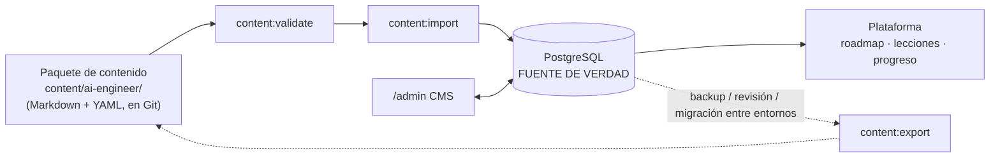
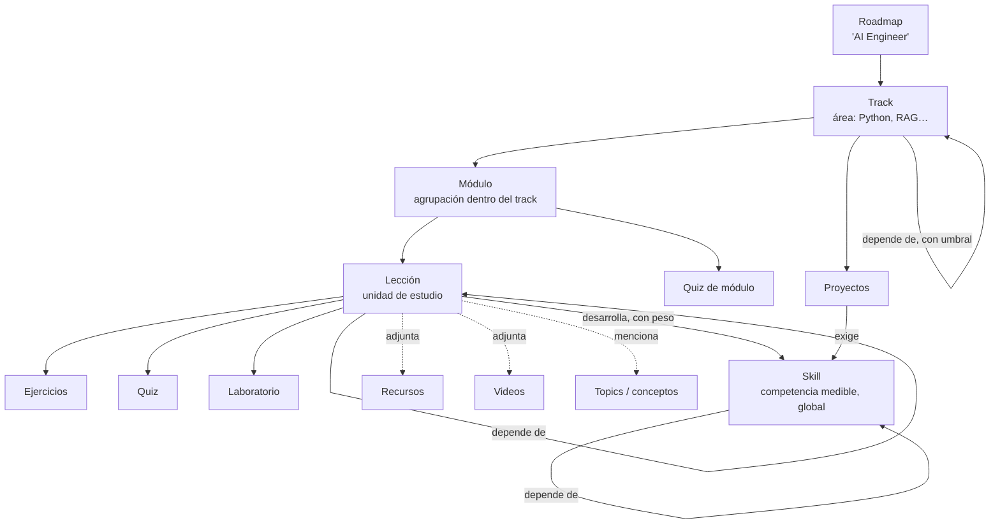

# Arquitectura de contenido

| | |
|---|---|
| Estado | v1.0: diseño (el importador se implementa en la Fase 3, el contenido desde la Fase 5) |
| Relacionados | [curriculum](curriculum.md) · [database](database.md) · [architecture](architecture.md) |

---

## 1. Las dos capas y la regla de la fuente de verdad



- **La base de datos es la fuente de verdad** una vez importado el contenido. El CMS edita la BD y la plataforma lee de la BD.
- El **paquete de contenido** sirve para tres cosas: (1) cargar el currículo inicial, (2) revisar contenido con diffs de Git, y (3) mover contenido entre entornos. No es la fuente en tiempo de ejecución, y **ningún archivo del paquete se lee al servir una página**.
- Ningún componente ni controlador contiene texto curricular. Añadir un track, una lección o un recurso **no requiere tocar código**.

## 2. Modelo conceptual



| Entidad | Definición operativa |
|---|---|
| **Roadmap** | Un camino de aprendizaje completo con su política de desbloqueo. En V1 hay uno: "AI Engineer" |
| **Track** | Área de conocimiento y nodo del grafo macro (p. ej., "RAG"). Pertenece a un roadmap |
| **Módulo** | Agrupación ordenada de lecciones dentro de un track (p. ej., "Recuperación avanzada") |
| **Lección** | Unidad de estudio con contrato pedagógico completo (§3). Tiene un slug global y estable |
| **Skill** | Competencia medible y reutilizable entre roadmaps (p. ej., `embeddings`). Su progreso se calcula desde las lecciones que la desarrollan |
| **Topic** | Concepto del glosario (p. ej., "self-attention"). Enriquece la búsqueda y la navegación (Fase 7) |
| **Ejercicio** | Práctica corta, calificable automáticamente o autoevaluada con rúbrica |
| **Quiz** | Evaluación calificada en el servidor que habilita MASTERED |
| **Laboratorio** | Práctica guiada paso a paso en el entorno del estudiante |
| **Proyecto** | Entregable de portfolio con milestones |
| **Recurso** | Enlace externo curado (preferentemente documentación oficial) con verificación |
| **Video** | Video externo (YouTube) o alojado, referenciado por proveedor e ID |

## 3. Contrato pedagógico

Toda lección publicada responde las siete preguntas de §5. La respuesta sale de un campo o de una relación, no de la buena voluntad del autor. `PublishReadiness` lo valida antes de publicar.

| Pregunta | Fuente | ¿Obligatorio para publicar? |
|---|---|---|
| ¿Qué es? | `summary` (1–3 frases) y `body` | Sí: `summary` ≥ 80 caracteres y `body` ≥ 1.500 caracteres de texto plano extraído |
| ¿Por qué importa? | `why_it_matters` (aplicación profesional concreta) | Sí, ≥ 80 caracteres |
| ¿Qué debo saber antes? | `lesson_dependencies` + prerequisitos de skill (calculado) | No: una lección puede no tener prerequisitos. Si se declaran, deben existir |
| ¿Qué aprendo después? | Dependientes en el grafo más la siguiente lección por posición (calculado) | Automático |
| ¿Cómo se practica? | Ejercicios, laboratorio o la sección `## Práctica` del cuerpo | Sí: al menos uno de los tres |
| ¿Cómo sé que lo aprendí? | Quiz (nivel A) u objetivos como autoevaluación (nivel B) | Sí: ≥ 2 `learning_objectives` con verbo observable |
| ¿Qué proyecto puedo construir? | Proyectos cuyas skills incluyen las de la lección (calculado) | Automático |

Otros requisitos para publicar: ≥ 1 skill asociada, `difficulty`, `estimated_minutes`, y módulo y track publicados.

### Anatomía de la página de lección (§29)

| Sección de §29 | Origen |
|---|---|
| Overview | `summary` + objetivos |
| Why it matters | `why_it_matters` |
| Prerequisites | Dependencias con su estado para el estudiante (✓, en curso, pendiente) |
| Theory / Examples / Code | `body` (RichContent) |
| Exercises / Lab / Quiz | Relaciones (Fase 6) |
| Project | Proyectos relacionados por skills |
| Resources / Videos | `resource_links` / `video_links` |
| Next steps | Dependientes + siguiente lección + recomendación del motor |

## 4. Plantilla del cuerpo de una lección

Las secciones son H2 fijos para que todas las lecciones se lean igual. El ejemplo va en la sintaxis de autoría del paquete; en el editor TipTap son encabezados de nivel 2. Las que no apliquen se omiten, salvo las marcadas como obligatorias.

```markdown
## Concepto                 ← obligatorio: la idea explicada con precisión
## Cómo funciona            ← mecanismo, paso a paso, con un ejemplo mínimo
## En código                ← si aplica: ejemplo ejecutable y comentado
## Errores comunes          ← obligatorio en nivel A: los fallos reales que se cometen
## En AI Engineering        ← obligatorio: dónde aparece en ML / LLM / sistemas de IA (§8: "cada concepto debe conectarse con ML")
## Práctica                 ← obligatorio si no hay ejercicio ni laboratorio asociado
```

## 5. Modelo de contenido enriquecido y formato de autoría (ADR-023)

**En la BD y en el CMS** el contenido largo (cuerpo de la lección, descripciones, enunciados, explicaciones) es un documento **RichContent**: `{"version": 1, "doc": <documento ProseMirror>}`. Se edita con TipTap y se valida en el servidor contra este esquema:

| Nodo | Atributos | Restricciones |
|---|---|---|
| `paragraph`, `blockquote`, `bulletList`, `orderedList` {start}, `listItem`, `horizontalRule`, `hardBreak` | — | — |
| `heading` | `level` | Solo 2, 3 o 4 (el H1 es el título de la lección) |
| `codeBlock` | `language` | `[a-z0-9+#-]{1,20}` o vacío |
| `table`, `tableRow`, `tableHeader`, `tableCell` | — | Celdas con párrafos |
| `callout` | `variant` | note, tip, important, warning, caution |
| `inlineMath`, `blockMath` | `latex` | ≤ 2.000 caracteres |
| `diagram` | `kind`, `source` | `kind = mermaid`; `source` ≤ 10.000 caracteres |
| `video` | `provider`, `videoId` | `youtube`; ID de 11 caracteres `[A-Za-z0-9_-]` |
| `image` (Fase 6) | `mediaId`, `alt` | `alt` obligatorio; `mediaId` debe existir en `media_assets` |
| Marcas `bold`, `italic`, `strike`, `code`, `link` | `link.href` | `https:`, `http:`, `mailto:` o ruta relativa `/…` |

Límites globales: documento ≤ 512 KB y profundidad ≤ 12. Cualquier nodo, marca o atributo fuera de la lista blanca **rechaza el guardado** con un error que indica la ruta del nodo.

**Extender el modelo** (p. ej., un nodo `quizEmbed` o `excalidraw`) requiere tres piezas: la regla en `RichContentSchema` (PHP), la extensión TipTap y el componente React compartido. Si el cambio no es retrocompatible, se sube la `version` del sobre y se escribe un migrador.

**En el paquete de contenido** los autores escriben **Markdown compatible con GitHub**, que se lee bien en los PR y se convierte a RichContent al importar:

| Nodo | Sintaxis de autoría |
|---|---|
| Texto, listas, enlaces, tablas, tachado | GFM estándar |
| `codeBlock` | ```` ```python ```` (el lenguaje es obligatorio en el nivel A) |
| `callout` | Alertas de GitHub: `> [!TIP]`, `> [!NOTE]`, `> [!IMPORTANT]`, `> [!WARNING]`, `> [!CAUTION]` |
| `blockMath` / `inlineMath` | ```` ```math ```` y `$x^2$` |
| `diagram` | ```` ```mermaid ```` |
| `video` | ```` ```video ```` con las líneas `provider: youtube` e `id: VIDEO_ID` |
| HTML crudo, imágenes (hasta la Fase 6), H1 | **Error de validación** |

## 6. Formato del paquete de contenido

Hay un archivo por entidad. La identidad es la **clave** declarada en el front matter, no la ruta: renombrar o mover un archivo no crea duplicados. El prefijo numérico `NN-` define la posición.

```text
content/
└── ai-engineer/
    ├── roadmap.yaml                         # key, title, locale, unlock_policy, mastery_threshold
    ├── tracks/
    │   └── 11-llm-engineering/
    │       ├── track.md                     # front matter + descripción
    │       └── 02-construir-con-llms/
    │           ├── module.md
    │           ├── 01-prompt-engineering.md # lección
    │           └── 03-tool-calling.md
    ├── skills/
    │   └── tool-calling.md
    ├── resources/
    │   └── llm-engineering.yaml             # lista de recursos del área, cada uno con su key
    ├── videos/
    │   └── transformers.yaml
    ├── quizzes/        <quiz-key>.yaml       (Fase 6)
    ├── exercises/      <track>/<key>.md      (Fase 6)
    ├── labs/           <key>.md              (Fase 6)
    ├── projects/       <key>.md              (Fase 6)
    └── badges.yaml                           (Fase 7)
```

### Ejemplo: lección

```yaml
---
key: llm.tool-calling                 # estable; nunca cambia
slug: tool-calling                    # URL; editable
title: Tool calling / function calling
type: TUTORIAL
difficulty: INTERMEDIATE
estimated_minutes: 50
status: PUBLISHED
last_reviewed: 2026-09-25
summary: >-
  Cómo un LLM decide invocar funciones de tu sistema devolviendo una llamada
  estructurada en lugar de texto, y cómo tu código ejecuta esa llamada y le
  devuelve el resultado.
why_it_matters: >-
  Tool calling convierte un modelo de texto en un componente que consulta bases
  de datos, llama APIs internas y actúa. Es la base de los agentes y de casi
  cualquier integración empresarial con LLMs.
objectives:
  - Definir una herramienta con un JSON Schema que el modelo pueda usar sin ambigüedad.
  - Implementar el ciclo solicitud → ejecución → resultado → respuesta final.
  - Validar y autorizar los argumentos generados por el modelo antes de ejecutarlos.
skills:
  - { key: tool-calling, weight: 3 }
  - { key: structured-outputs, weight: 1 }
depends_on:
  - { lesson: llm.structured-outputs, kind: REQUIRED }
  - { lesson: llm.prompt-engineering, kind: RECOMMENDED }
resources: [anthropic-tool-use-docs, openai-function-calling-docs]
---
## Concepto
…
```

### Ejemplo: skill

```yaml
---
key: tool-calling
name: Tool calling
difficulty: INTERMEDIATE
status: PUBLISHED
depends_on:
  - { skill: structured-outputs, kind: REQUIRED, min_progress: 60 }
  - { skill: python-typing, kind: RECOMMENDED, min_progress: 50 }
---
Capacidad de exponer funciones del sistema a un LLM de forma segura…
```

### Ejemplo: recursos

```yaml
# resources/python.yaml
- key: python-docs-tutorial
  title: The Python Tutorial
  url: https://docs.python.org/3/tutorial/
  type: DOCUMENTATION
  provider: Python Software Foundation
  is_official: true
  difficulty: BEGINNER
  language: en
  description: Tutorial oficial; referencia primaria para la sintaxis y el modelo de datos.
```

## 7. Comandos del paquete

| Comando | Comportamiento | Fase |
|---|---|---|
| `content:validate {path}` | Valida el esquema del front matter y los enums. Comprueba claves únicas, referencias resolubles (skills, lecciones, recursos) y **aciclicidad** de los tres grafos, contrato pedagógico en lo que tenga `status: PUBLISHED`, y que el Markdown se convierta a un RichContent válido. Sale con código ≠ 0 y errores con archivo y línea. Corre en CI | 3 |
| `content:import {path} [--dry-run] [--force] [--only=…]` | Upsert idempotente en una transacción. Resuelve la identidad por `(package, key)` en `content_import_records`. **Si el hash actual de la entidad difiere del `source_hash` registrado, se editó en el CMS y se salta** (con aviso) salvo `--force`. Convierte el Markdown a RichContent y crea `lesson_versions` para lo publicado. Registra `IMPORTED` en `audit_logs`. `--dry-run` informa de lo que crearía, actualizaría o saltaría | 3 |
| `content:export {path}` | BD → paquete, con el mismo formato. Sirve para backup, revisión y migración entre entornos | 7 |
| `content:verify-links [--source=db\|files]` | Verifica recursos (HEAD con fallback a GET, 3 reintentos con backoff, sigue redirecciones) y videos (YouTube oEmbed). Actualiza `link_status` | 5 (recursos), 6 (videos) |

## 8. Verificación de enlaces y videos

**Restricción de este entorno [H]:** el contenedor de desarrollo no tiene acceso a sitios externos, así que las URLs **no se pueden verificar al escribirlas**.

Controles, en capas:

1. **Política editorial:** solo se admiten dominios de documentación oficial, repositorios oficiales, papers (arXiv o DOI) y fuentes reconocidas. Nada de blogs anónimos ni URLs "plausibles".
2. **CI (job `content`)** en cada PR que toque `content/`: `content:verify-links --source=files`. **Un 404 o 410 bloquea el merge.** Los 5xx y los *timeouts* se reintentan y, si persisten, solo avisan (una caída externa temporal no debe bloquear).
3. **Producción:** el scheduler ejecuta `content:verify-links --source=db` cada semana. Un recurso `BROKEN` **se oculta al estudiante** y aparece en el admin con un filtro "enlaces rotos".
4. **Videos:** solo entran con un ID validado por oEmbed. Un video eliminado o privado pasa a `BROKEN` y se oculta.

## 9. Niveles de profundidad y plan del seed

La spec pide volumen (100 o más lecciones) **y** prohíbe el texto mediocre. Las dos cosas se concilian con dos niveles explícitos, no fingiendo que todo tiene la misma profundidad.

| Nivel | Qué incluye | Longitud del cuerpo | Evaluación | Cantidad objetivo |
|---|---|---|---|---|
| **A: lección completa** | Contrato completo, las 6 secciones del cuerpo, código ejecutable, errores comunes | 1.200–2.500 palabras | Quiz de 5–8 preguntas + ≥ 1 ejercicio | 20 en V1.1 (unas 5 ya en V1, sin quiz hasta la Fase 6) |
| **B: ficha pedagógica** | Contrato completo; cuerpo con Concepto, Cómo funciona, En AI Engineering y Práctica | 350–700 palabras | Objetivos como autoevaluación | ≥ 100 publicadas en V1 |
| **Backlog** | Título, resumen y objetivos | — | — | El resto, como **DRAFT** (visible solo en el CMS) |

- La **ruta crítica "aplicaciones primero"** recibe primero el nivel A: tokens, sampling, prompts, salidas estructuradas, tool calling, embeddings, RAG, agentes y prompt injection. El nivel A de fundamentos cubre typing, pytest, NumPy, producto punto, train/test, overfitting y métricas.
- Ver el mapa completo y la asignación de niveles en [curriculum.md](curriculum.md).

## 10. Guía de estilo

- **Idioma:** español neutro. Los términos estándar de la industria van en inglés, en cursiva o código la primera vez y con explicación (*embedding*, *fine-tuning*, *prompt*). Los identificadores de código siempre en inglés.
- **Especificidad:** cada afirmación debe ser concreta y verificable. Se prohíben frases de relleno como "X es muy popular" o "X es muy importante hoy en día".
- **Objetivos:** con verbos observables (implementar, explicar, comparar, diagnosticar, medir). Nunca "entender" ni "conocer".
- **Volatilidad:** los conceptos estables se explican en el texto. Los detalles de API que cambian (nombres de parámetros, modelos concretos, precios) **no se escriben**: se enlaza la documentación oficial. Los tracks volátiles (LLM, RAG, Agents, Security) tienen `review_interval_months: 6` y el admin lista las lecciones con revisión vencida.
- **Código:** ejemplos mínimos y ejecutables, con dependencias declaradas; Python ≥ 3.11 y typing en los ejemplos de nivel A.
- **Honestidad:** si algo es debatido o depende del caso, se dice y se da el criterio de decisión.

## 11. Definition of Done del contenido

Una lección está lista para publicarse cuando:

1. Supera `PublishReadiness` (contrato y campos).
2. Tiene cuerpo según su nivel, sin relleno y sin afirmaciones no verificables.
3. Su código se ejecutó al menos una vez (nivel A).
4. Sus recursos pasan `content:verify-links`.
5. Pasó por REVIEW con alguien distinto del autor (o, si hay un solo editor, con una segunda lectura en otra sesión y la nota en `change_note`).
6. Tiene `last_reviewed` con fecha.
