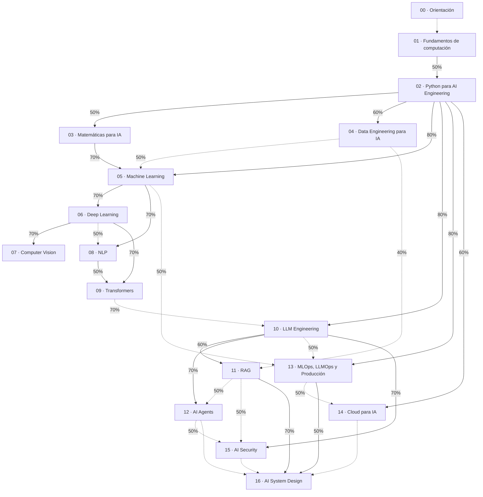

# Currículo inicial: AI Engineer

| | |
|---|---|
| Estado | v1.0: diseño curricular. Se materializa como paquete de contenido desde la Fase 5 |
| Relacionados | [content-architecture](content-architecture.md) · [product-discovery §6](product-discovery.md#6-contradicciones-de-la-spec-y-su-resolución) |

Este documento define **qué** se enseña y en qué orden. **No es la fuente del contenido**: el contenido vive en `content/ai-engineer/` (bootstrap) y después en la BD (CMS). Si el CMS cambia la estructura, este documento se actualiza o se regenera con `content:export`.

Leyenda de profundidad: **[A]** lección completa · **[B]** ficha pedagógica · **[·]** backlog (DRAFT, visible solo en el CMS).

---

## 1. Grafo macro de tracks

Línea continua = REQUIRED con el umbral de progreso del prerequisito. Línea punteada = RECOMMENDED.

**Dos rutas sobre el mismo grafo [O]:**

- **Fundamentos primero** (persona P2): Fundamentos → Python → Matemáticas y Datos → ML → DL → NLP y CV → Transformers → LLM → RAG y Agents → MLOps, Cloud y Security → System Design. Coincide con el orden del §25 de la spec.
- **Aplicaciones primero** (persona P1): Python (80 %) → **LLM Engineering** → RAG → Agents → Security → MLOps. Después se vuelve a Matemáticas, ML, DL y Transformers para ganar profundidad. Lo habilita que LLM Engineering *requiere* Python y solo *recomienda* Transformers. Las lecciones que de verdad necesitan DL (fine-tuning, LoRA, cuantización) declaran esa dependencia a nivel de lección.

## 2. Tracks, módulos y lecciones

### 00 · Orientación: el rol de AI Engineer (6)
- **El rol:** [A] Qué es AI Engineering · [B] AI Engineer frente a ML Engineer, Data Scientist, Data Engineer, MLOps Engineer y Software Engineer especializado en IA · [B] El ciclo de vida de un sistema de IA
- **Cómo aprender:** [B] Cómo estudiar y medir tu progreso · [B] Cómo construir un portfolio que demuestre competencia · [B] GitHub y documentación técnica como evidencia profesional

### 01 · Fundamentos de computación (19)
- **Programación:** [B] Variables, tipos y expresiones · [B] Control de flujo: condicionales y bucles · [B] Funciones y recursividad · [B] Excepciones y manejo de errores · [B] Modularidad, paquetes y dependencias · [B] Entornos virtuales
- **Estructuras de datos:** [B] Arrays, listas y tuplas · [B] Sets y diccionarios (tablas hash) · [B] Pilas y colas · [B] Árboles · [B] Grafos
- **Algoritmos:** [B] Notación Big O: complejidad temporal y espacial · [B] Búsqueda lineal y binaria · [B] Algoritmos de ordenamiento · [B] Recorridos de grafos: BFS y DFS
- **Git y colaboración:** [B] Git: commits, árbol de trabajo y staging · [B] Ramas, merge y rebase · [B] GitHub: pull requests y code review · [B] Conventional Commits y un historial legible

### 02 · Python para AI Engineering (18)
- **Python idiomático:** [B] Sintaxis y modelo de datos · [B] Programación orientada a objetos · [A] Dataclasses y typing · [B] Iteradores y generadores · [B] Decoradores · [B] Context managers
- **Concurrencia:** [B] async/await y asyncio · [B] Threads, procesos y el GIL
- **Ingeniería de software con Python:** [A] Testing con pytest · [B] Logging estructurado · [B] Packaging y proyectos con uv, Poetry y pip · [B] Construcción de CLIs · [B] APIs con FastAPI
- **Python para datos:** [A] NumPy: arrays y vectorización · [B] Pandas: transformación de DataFrames · [·] Polars: DataFrames de alto rendimiento · [B] Visualización con Matplotlib · [B] Jupyter y notebooks reproducibles

### 03 · Matemáticas para IA (13)
- **Álgebra lineal:** [A] Vectores y producto punto *(conecta directamente con la similitud de embeddings)* · [B] Matrices y multiplicación matricial · [B] Transpuesta, inversa y sistemas lineales · [B] Eigenvalues, eigenvectors y transformaciones
- **Cálculo:** [B] Derivadas y derivadas parciales · [B] Gradientes y regla de la cadena · [B] Gradient descent
- **Probabilidad:** [B] Variables aleatorias y distribuciones · [B] Esperanza, varianza y probabilidad condicional · [B] Teorema de Bayes
- **Estadística:** [B] Media, mediana y desviación · [B] Correlación y covarianza · [·] Inferencia estadística e intervalos de confianza

### 04 · Data Engineering para IA (10)
- **SQL y modelado:** [B] SQL esencial para IA · [B] PostgreSQL y modelado relacional
- **Pipelines:** [B] ETL, ELT y data pipelines · [B] Formatos: CSV, JSON y Parquet · [·] Ingesta desde APIs y web scraping responsable
- **Calidad de datos:** [B] Validación de datos · [B] Limpieza de datos · [B] Feature engineering
- **Almacenamiento:** [·] Data warehouses y data lakes · [B] Bases de datos vectoriales: fundamentos

### 05 · Machine Learning (16)
- **Fundamentos:** [B] Aprendizaje supervisado, no supervisado, semi-supervisado y por refuerzo · [A] Train, validation y test · [A] Overfitting, underfitting y bias-variance · [B] Validación cruzada
- **Algoritmos supervisados:** [B] Regresión lineal · [B] Regresión logística · [B] Árboles de decisión y Random Forest · [B] Gradient Boosting: XGBoost y LightGBM · [·] KNN y SVM
- **No supervisado:** [B] K-Means y clustering · [B] PCA y reducción de dimensionalidad
- **Evaluación y ajuste:** [A] Métricas de clasificación: accuracy, precision, recall y F1 · [B] ROC-AUC y matriz de confusión · [B] Métricas de regresión · [B] Regularización y selección de features · [B] Ajuste de hiperparámetros

### 06 · Deep Learning (10)
- **Redes neuronales:** [B] Del perceptrón a la red neuronal · [B] Funciones de activación · [B] Forward propagation y funciones de pérdida · [B] Backpropagation · [B] Optimizadores, learning rate, batch y epoch
- **Frameworks:** [B] PyTorch: tensores, autograd y training loop · [·] TensorFlow/Keras: panorama y cuándo elegirlo
- **Arquitecturas:** [B] Redes convolucionales (CNN) · [B] RNN, LSTM y GRU · [·] Autoencoders

### 07 · Computer Vision (7)
- **Fundamentos:** [B] Imágenes como tensores: píxeles y canales · [·] Convoluciones aplicadas a visión · [B] Clasificación de imágenes y transfer learning
- **Tareas:** [·] Detección de objetos · [·] Segmentación · [B] OCR · [·] Embeddings visuales y Vision Transformers

### 08 · NLP (6)
- **Texto clásico:** [B] Tokenización, stemming y lematización · [B] TF-IDF y bolsa de palabras · [B] Word embeddings y Word2Vec
- **Tareas:** [B] Clasificación de texto y análisis de sentimiento · [·] Reconocimiento de entidades (NER) · [·] Resumen y traducción automática

### 09 · Transformers (6)
- **Atención:** [B] Atención: la intuición · [A] Self-attention paso a paso · [B] Multi-head attention
- **Arquitectura:** [B] Positional encoding · [B] Token embeddings y context window · [B] Encoder, decoder y la arquitectura Transformer completa

### 10 · LLM Engineering (15)
- **Fundamentos:** [A] Cómo funciona un LLM: tokens y predicción del siguiente token · [A] Context window, temperature y sampling · [B] Selección de modelos: capacidad, costo y latencia
- **Construir con LLMs:** [A] Prompt engineering y system prompts · [A] Structured outputs · [A] Tool calling / function calling · [B] Streaming de respuestas · [A] Embeddings para búsqueda semántica · [B] Integración multiproveedor: OpenAI, Anthropic, Gemini y modelos locales
- **Adaptación de modelos** (requiere lecciones de DL y Transformers): [B] Fine-tuning: cuándo sí y cuándo no · [B] LoRA y QLoRA · [B] Cuantización
- **Inferencia y evaluación:** [B] Inferencia local y servida: Ollama y vLLM · [B] Hugging Face: Hub, Transformers y Datasets · [B] Evaluación de LLMs

### 11 · RAG (11)
- **Pipeline:** [A] Arquitectura RAG de punta a punta · [B] Parsing de documentos · [A] Chunking y metadata · [B] Indexación en bases vectoriales: pgvector, Qdrant, Pinecone y Weaviate
- **Recuperación avanzada:** [B] Búsqueda semántica, léxica e híbrida · [B] Reranking · [B] Query rewriting y context compression · [B] Construcción del prompt con contexto
- **Calidad:** [A] Evaluación de retrieval y de respuestas · [B] Mitigación de alucinaciones · [B] Naive RAG frente a Advanced RAG: decisiones de diseño

### 12 · AI Agents (10)
- **Fundamentos:** [A] Qué es un agente: el agent loop · [B] Tool use y diseño de herramientas · [B] Planning · [B] Memoria y estado
- **Control y escala:** [B] Human-in-the-loop · [·] Sistemas multi-agente · [B] Frameworks: LangChain, LangGraph y LlamaIndex · [B] Model Context Protocol (MCP)
- **Calidad:** [B] Evaluación de agentes · [B] Seguridad en agentes

### 13 · MLOps, LLMOps y Producción (11)
- **Experimentación:** [B] Experiment tracking con MLflow y Weights & Biases · [B] Versionado de datasets y modelos; model registry
- **Despliegue:** [B] Docker para aplicaciones de IA · [B] CI/CD con GitHub Actions · [·] Kubernetes: conceptos para servir modelos · [B] Diseño de APIs de inferencia · [·] Colas, background jobs y caching
- **Observabilidad:** [B] Logging, monitoring y tracing · [B] Drift, calidad de datos y calidad de modelo · [B] LLMOps: evaluación continua y versionado de prompts
- **Operación:** [B] Rate limits, escalado y optimización de costos

### 14 · Cloud para IA (5)
- **Cloud aplicado a IA:** [B] Conceptos cloud para IA: compute, storage y networking · [·] Contenedores y serverless para inferencia · [B] GPUs: cuándo y cómo · [·] Servicios de ML gestionados en AWS, Azure y Google Cloud · [B] IAM, secretos y observabilidad en cloud

### 15 · AI Security (6)
- **Ataques a LLMs:** [A] Prompt injection y jailbreaking · [B] RAG poisoning · [B] Tool calling inseguro y abuso de modelos
- **Controles:** [B] Data leakage, PII y privacidad · [B] Autenticación, autorización y control de acceso en sistemas de IA · [B] Rate limiting y audit logs

### 16 · AI System Design (9)
- **Método:** [B] Cómo diseñar sistemas de IA: requisitos, trade-offs, costo y latencia · [B] Escalabilidad, disponibilidad y observabilidad
- **Casos:** [B] Chatbot empresarial · [B] Sistema RAG a escala · [·] Recomendador · [·] Pipeline de OCR · [·] Plataforma de agentes · [·] Sistema de inferencia · [·] Plataforma de IA multi-tenant

### Totales

| | Lecciones |
|---|---|
| **[A]** Completas | 20 |
| **[B]** Fichas | 135 |
| **[·]** Backlog (DRAFT) | 23 |
| **Total planificado** | **178** en 17 tracks y 50 módulos |

**Metas de publicación:** ≥ 100 publicadas al cerrar la Fase 5 (prioridad: tracks 00, 02, 03, 05, 09, 10, 11, 12 y 15, completos en nivel B, y el cuerpo A de 5 lecciones). Las 155 A+B publicadas y las 20 A con quiz y ejercicio al cerrar la Fase 6. El backlog queda como demostración viva de que el CMS hace crecer el currículo.

## 3. Skills (72)

Formato: `clave`: prerequisitos (R = REQUIRED, r = RECOMMENDED, con el umbral en %).

- **Fundamentos:** `programming-fundamentals` · `data-structures`: R programming-fundamentals 60 · `algorithms`: R data-structures 60 · `git`: r programming-fundamentals · `technical-communication`
- **Python:** `python`: R programming-fundamentals 70 · `python-typing`: R python 60 · `python-async`: R python 80 · `python-testing`: R python 60 · `python-packaging`: R python 50 · `api-development`: R python 70, r python-typing 50 · `numpy`: R python 60, r linear-algebra 30 · `dataframes`: R numpy 50 · `data-visualization`: R dataframes 40
- **Matemáticas:** `linear-algebra` · `calculus` · `probability` · `statistics`: R probability 50
- **Datos:** `sql`: R programming-fundamentals 50 · `data-modeling`: R sql 60 · `data-pipelines`: R python 60, r sql 50 · `data-quality`: R dataframes 50 · `feature-engineering`: R dataframes 60, r statistics 50 · `data-platforms`: R sql 60 · `vector-databases`: R sql 40, r linear-algebra 40
- **ML:** `ml-fundamentals`: R python 70, statistics 50, linear-algebra 50 · `supervised-learning`: R ml-fundamentals 60 · `unsupervised-learning`: R ml-fundamentals 60 · `model-evaluation`: R ml-fundamentals 50 · `hyperparameter-tuning`: R supervised-learning 50, model-evaluation 60 · `gradient-boosting`: R supervised-learning 60 · `scikit-learn`: R ml-fundamentals 40, numpy 60
- **DL:** `neural-networks`: R ml-fundamentals 70, calculus 60 · `pytorch`: R neural-networks 50, numpy 60 · `cnn`: R neural-networks 70 · `sequence-models`: R neural-networks 70
- **CV:** `computer-vision`: R cnn 60, pytorch 50 · `transfer-learning`: R pytorch 60 · `ocr`: R python 70, r computer-vision 40
- **NLP:** `nlp`: R ml-fundamentals 60, python 70 · `text-classification`: R nlp 50, supervised-learning 50
- **Transformers:** `attention`: R neural-networks 60, linear-algebra 70 · `transformers`: R attention 70, r sequence-models 40
- **LLM:** `llm-fundamentals`: R python 70, r transformers 50 · `prompt-engineering`: R llm-fundamentals 50 · `structured-outputs`: R prompt-engineering 50, python-typing 50 · `tool-calling`: R structured-outputs 60 · `embeddings`: R llm-fundamentals 50, r linear-algebra 40 · `llm-evaluation`: R prompt-engineering 60, r statistics 40 · `fine-tuning`: R pytorch 60, transformers 60 · `llm-inference`: R llm-fundamentals 60 · `hugging-face`: R python 70, r transformers 40
- **RAG:** `rag`: R embeddings 60, vector-databases 50, prompt-engineering 60 · `advanced-retrieval`: R rag 60 · `rag-evaluation`: R rag 60, llm-evaluation 50
- **Agents:** `ai-agents`: R tool-calling 70, r rag 40 · `agent-frameworks`: R ai-agents 50 · `mcp`: R tool-calling 60
- **MLOps y producción:** `docker`: R programming-fundamentals 60 · `ci-cd`: R git 70, python-testing 50, r docker 50 · `experiment-tracking`: R ml-fundamentals 50 · `model-serving`: R api-development 60, docker 50 · `observability`: R model-serving 40 · `llmops`: R llm-evaluation 50, observability 40 · `kubernetes`: R docker 70
- **Cloud:** `cloud-fundamentals`: R docker 40 · `gpu-computing`: R cloud-fundamentals 50, r pytorch 40 · `cloud-ml-services`: R cloud-fundamentals 60
- **Seguridad:** `llm-security`: R llm-fundamentals 60, r tool-calling 40 · `data-privacy`: r llm-fundamentals · `access-control`: R api-development 50
- **Diseño de sistemas:** `ai-system-design`: R rag 70, model-serving 50, r llmops, llm-security, cloud-fundamentals

## 4. Proyectos de portfolio (§23)

Cada proyecto se publica con su problema, contexto, requisitos, arquitectura, stack, dataset, milestones, tareas, evaluación, entregables, skills y preguntas de entrevista (§37). Los datasets propuestos se eligen para **no depender de URLs externas**: vienen incluidos en librerías o se generan con un script propio.

| # | Proyecto | Track ancla | Problema | Dataset | Skills clave |
|---|---|---|---|---|---|
| P01 | **Data profiler CLI** | Python | Validar y perfilar archivos CSV y Parquet (esquema, nulos, tipos, outliers) y emitir un reporte | Archivos propios y sintéticos | python, python-typing, python-testing, python-packaging |
| P02 | **Análisis exploratorio reproducible** | Datos | Responder preguntas de negocio con un análisis versionado y reproducible | California Housing (`sklearn.datasets`) | dataframes, data-visualization, statistics, data-quality |
| P03 | **API de predicción con FastAPI** | ML | Servir un modelo de regresión con validación, tests y Docker | California Housing | supervised-learning, model-evaluation, api-development, docker |
| P04 | **Clasificador de imágenes con PyTorch** | DL | Entrenar, evaluar y exponer un clasificador con una demo | Fashion-MNIST (`torchvision.datasets`) | pytorch, neural-networks, cnn |
| P05 | **Extracción de datos de facturas (OCR)** | CV | Convertir facturas escaneadas en datos estructurados validados | Facturas sintéticas generadas por script (sin PII ni licencias) | ocr, computer-vision, data-quality, structured-outputs |
| P06 | **Clasificador de tickets de soporte** | NLP | Enrutar tickets automáticamente: línea base TF-IDF frente a un modelo Transformer | 20 Newsgroups (`sklearn.datasets`) como sustituto de tickets | text-classification, nlp, model-evaluation, hugging-face |
| P07 | **Asistente de documentación interna (RAG)** | RAG | Responder preguntas sobre documentación con citas y evaluación | Documentación de un proyecto open source con licencia permisiva | rag, advanced-retrieval, rag-evaluation, vector-databases |
| P08 | **Agente de automatización de solicitudes** | Agents | Resolver solicitudes internas con herramientas y aprobación humana en acciones con efectos | Herramientas simuladas (inventario, tickets) | ai-agents, tool-calling, mcp, llm-security |
| P09 | **Llevar el RAG a producción** | MLOps | Operar el P07 con CI/CD, tracing, evaluación continua, rate limiting y control de costos | Igual que P07 | llmops, observability, ci-cd, model-serving, access-control |
| P10 | **Plataforma de IA multi-tenant (proyecto final)** | System Design | Diseñar e implementar un servicio de IA para varios clientes con aislamiento, SLOs y costos | Datos sintéticos por tenant | ai-system-design, llm-security, cloud-fundamentals, access-control |

Los proyectos P05, P06 y P08 se eligieron por su cercanía a la automatización de procesos empresariales: son casos defendibles en una entrevista con evidencia de impacto de negocio.
