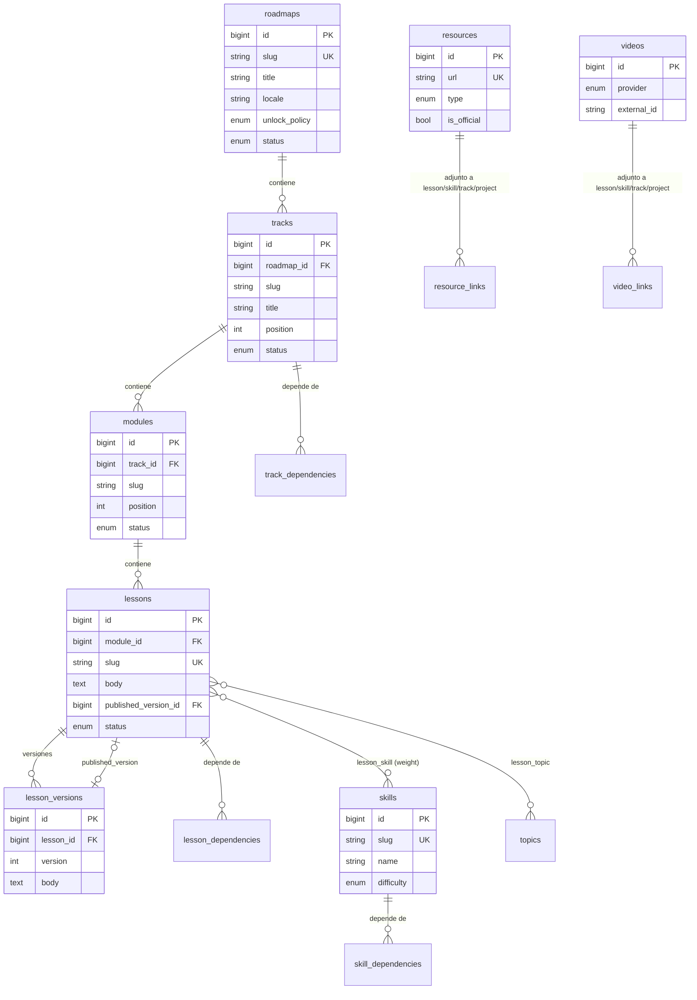
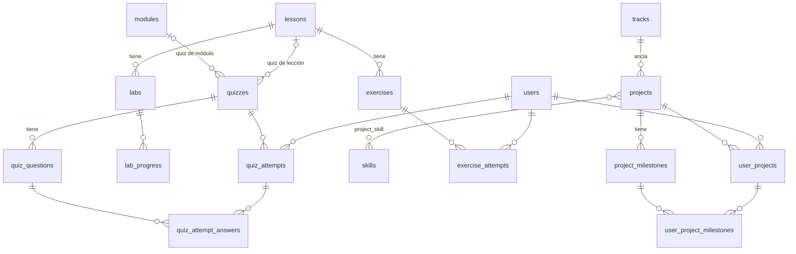
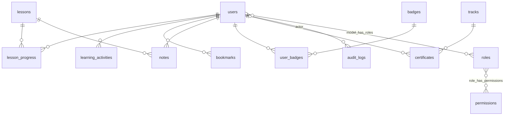

# Modelo de datos

| | |
|---|---|
| Estado | v1.0: diseño (Fase 3). Las migraciones aún no existen |
| Motor | PostgreSQL 16 |
| Relacionados | [architecture](architecture.md) · [content-architecture](content-architecture.md) |

---

## 1. Convenciones

- Claves primarias `bigint` autoincrementales (`id()`). Las URLs públicas usan `slug`, nunca `id`.
- `timestamps()` en UTC. La zona horaria del usuario solo se usa para calcular rachas (`occurred_on`).
- Nombres de tablas en inglés, plural y snake_case. Los pivotes siguen la convención de Laravel (singular y en orden alfabético: `lesson_skill`).
- **Enums:** columnas creadas con `$table->enum()`, que en Postgres genera `varchar` + `CHECK (col IN (...))`. El enum PHP es la fuente de verdad y se exporta a TypeScript. Añadir un valor exige migración, lo cual es deseable: un tipo nuevo también requiere código.
- **Integridad:** FK en todas las relaciones estructurales. `ON DELETE RESTRICT` desde los datos del estudiante hacia el contenido (el contenido con historia se archiva, no se borra) y `ON DELETE CASCADE` desde el usuario hacia sus datos.
- **Relaciones polimórficas** solo para *adjuntables* genéricos (recursos, videos, marcadores y auditoría), con **morph map forzado** (`lesson`, `track`, `skill`, `project`, `resource`, `video`, `lab`, `exercise`, `quiz`, `module`, `roadmap`, `user`). La limpieza al borrar la hace el dominio.
- **Sin soft deletes en el contenido.** El estado ARCHIVED cumple ese rol con semántica explícita. El borrado físico solo es posible si ninguna FK RESTRICT lo impide.
- **JSONB** solo para estructuras que siempre se leen completas con su dueño (objetivos, opciones de pregunta, pasos, criterios de insignia). Nada que se filtre o se una por separado va en JSONB.

## 2. Enums

| Enum | Valores | Uso |
|---|---|---|
| `ContentStatus` | DRAFT, REVIEW, PUBLISHED, ARCHIVED | Todas las entidades de contenido |
| `Difficulty` | BEGINNER, INTERMEDIATE, ADVANCED, EXPERT | Tracks, lecciones, skills, ejercicios, proyectos, recursos, videos |
| `ContentType` | CONCEPT, TUTORIAL, EXERCISE, LAB, PROJECT, QUIZ, READING, VIDEO, DOCUMENTATION, CHALLENGE | Clasificador transversal (búsqueda y filtros). `lessons.content_type` admite solo CONCEPT, TUTORIAL, READING, VIDEO, DOCUMENTATION y CHALLENGE; el resto son entidades propias |
| `ProgressStatus` (persistido) | IN_PROGRESS, COMPLETED, MASTERED | `lesson_progress`, `lab_progress` |
| `NodeState` (calculado, no se guarda) | LOCKED, AVAILABLE, IN_PROGRESS, COMPLETED, MASTERED | Respuestas de la API y UI |
| `DependencyKind` | REQUIRED, RECOMMENDED | Tablas de dependencias |
| `UnlockPolicy` | ADVISORY, STRICT | `roadmaps` |
| `ExerciseType` | MULTIPLE_CHOICE, CODE, CONCEPTUAL, ORDERING, MATCHING, DEBUGGING, ARCHITECTURE | `exercises` |
| `QuestionType` | SINGLE_CHOICE, MULTIPLE_CHOICE, TRUE_FALSE, ORDERING, MATCHING | `quiz_questions` (solo tipos calificables automáticamente) |
| `ResourceType` | DOCUMENTATION, ARTICLE, TUTORIAL, COURSE, BOOK, PAPER, REPOSITORY, TOOL | `resources` |
| `VideoProvider` | YOUTUBE, VIMEO, HOSTED | `videos` |
| `MediaKind` | IMAGE, AUDIO, VIDEO, FILE | `media_assets` (TEXT, CODE, DIAGRAM y EMBED de §55 se expresan en el Markdown) |
| `UserProjectStatus` | IN_PROGRESS, SUBMITTED, COMPLETED | `user_projects` |
| `ActivityType` | LESSON_STARTED, LESSON_COMPLETED, LESSON_MASTERED, EXERCISE_SOLVED, QUIZ_PASSED, QUIZ_FAILED, LAB_COMPLETED, MILESTONE_COMPLETED, PROJECT_COMPLETED, SKILL_MASTERED, TRACK_COMPLETED, BADGE_EARNED, CERTIFICATE_ISSUED | `learning_activities` |
| `ProfileVisibility` | PRIVATE, PUBLIC | `users` |
| `AuditAction` | CREATED, UPDATED, DELETED, SUBMITTED, PUBLISHED, UNPUBLISHED, ARCHIVED, RESTORED, ROLE_ASSIGNED, ROLE_REVOKED, IMPORTED | `audit_logs` |

## 3. Diagramas entidad-relación

### 3.1 Currículo



### 3.2 Evaluación y práctica (Fase 6)



### 3.3 Estado del estudiante, gamificación y gobierno



## 4. Tablas

Notación: `FK→tabla (acción)`, `UK` = único, `IX` = índice, `CK` = check.

### 4.1 Identidad y acceso (Fase 3)

```text
users                         (extiende la tabla del starter kit)
  + username          citext UK NULL      -- requerido para el portfolio público; citext = único sin distinguir mayúsculas
  + locale            varchar(5) DEFAULT 'es'
  + timezone          varchar(64) DEFAULT 'UTC'
  + bio               text NULL
  + avatar_path       varchar NULL
  + profile_visibility enum ProfileVisibility DEFAULT 'PRIVATE'
  + xp_total          integer DEFAULT 0   -- caché de Σ learning_activities.xp, actualizado en la misma transacción
  + last_active_at    timestamp NULL
  CK xp_total >= 0

roles, permissions, model_has_roles, model_has_permissions, role_has_permissions   (spatie/laravel-permission)
passkeys, sessions, password_reset_tokens, cache, jobs, failed_jobs                  (framework / starter kit)
```

### 4.2 Currículo (Fase 3)

```text
roadmaps
  id, slug UK, title, summary text, description text (md)
  locale varchar(5) DEFAULT 'es'
  unlock_policy enum UnlockPolicy DEFAULT 'ADVISORY'
  mastery_threshold smallint DEFAULT 90           CK BETWEEN 50 AND 100
  status enum ContentStatus DEFAULT 'DRAFT', published_at NULL
  created_by FK→users (SET NULL), updated_by FK→users (SET NULL), timestamps

tracks
  id, roadmap_id FK→roadmaps (RESTRICT)
  slug, title, summary text, description text (md), why_it_matters text
  icon varchar NULL                               -- nombre de icono lucide
  position smallint, difficulty enum Difficulty, estimated_hours smallint NULL
  review_interval_months smallint NULL            -- p. ej. 6 en tracks volátiles
  status, published_at, created_by, updated_by, timestamps
  UK (roadmap_id, slug) · IX (roadmap_id, position) · IX (status)

track_dependencies
  track_id FK→tracks (CASCADE), prerequisite_track_id FK→tracks (CASCADE)
  kind enum DependencyKind DEFAULT 'REQUIRED'
  min_progress smallint DEFAULT 100               CK BETWEEN 1 AND 100
  PK (track_id, prerequisite_track_id) · CK track_id <> prerequisite_track_id
  IX (prerequisite_track_id)                      -- consulta de "dependientes"

modules
  id, track_id FK→tracks (RESTRICT), slug, title, summary text, position smallint
  status, published_at, timestamps
  UK (track_id, slug) · IX (track_id, position)

lessons                                           -- COPIA DE TRABAJO (editable)
  id, module_id FK→modules (RESTRICT)
  slug UK                                         -- global: mover una lección de módulo no rompe su URL
  title, summary text, why_it_matters text
  learning_objectives jsonb DEFAULT '[]'          -- array de strings
  body text (md)
  content_type enum (subconjunto de ContentType) DEFAULT 'CONCEPT'
  difficulty enum Difficulty, estimated_minutes smallint   CK BETWEEN 1 AND 600
  position smallint
  status enum ContentStatus DEFAULT 'DRAFT'
  published_version_id FK→lesson_versions (SET NULL) NULL
  published_at NULL, last_reviewed_at date NULL
  created_by, updated_by, timestamps
  IX (module_id, position) · IX (status) · IX (published_version_id)

lesson_versions                                   -- SNAPSHOT INMUTABLE (solo INSERT)
  id, lesson_id FK→lessons (CASCADE), version integer
  title, summary, why_it_matters, learning_objectives jsonb, body, content_type,
  difficulty, estimated_minutes
  content_hash char(64)                           -- sha256 de los campos versionados
  change_note varchar NULL
  published_by FK→users (SET NULL), published_at timestamp, created_at
  UK (lesson_id, version)

lesson_dependencies
  lesson_id FK→lessons (CASCADE), prerequisite_lesson_id FK→lessons (CASCADE)
  kind enum DependencyKind DEFAULT 'REQUIRED'
  PK (lesson_id, prerequisite_lesson_id) · CK lesson_id <> prerequisite_lesson_id
  IX (prerequisite_lesson_id)

skills
  id, slug UK, name, description text, icon NULL
  difficulty enum Difficulty
  status, published_at, timestamps

skill_dependencies
  skill_id FK→skills (CASCADE), prerequisite_skill_id FK→skills (CASCADE)
  kind enum DependencyKind DEFAULT 'REQUIRED'
  min_progress smallint DEFAULT 70                CK BETWEEN 1 AND 100
  PK (skill_id, prerequisite_skill_id) · CK skill_id <> prerequisite_skill_id

lesson_skill
  lesson_id FK→lessons (CASCADE), skill_id FK→skills (CASCADE)
  weight smallint DEFAULT 1                       CK BETWEEN 1 AND 5
  PK (lesson_id, skill_id) · IX (skill_id)
```

Relaciones que la BD no puede garantizar y que valida el dominio (`DependencyGraph`):

- **Aciclicidad** de cada grafo de dependencias. Se verifica en la Action que escribe aristas (DFS sobre el grafo más la arista nueva) y se rechaza con un error de validación que nombra el ciclo.
- `track_dependencies`: ambos tracks pertenecen al mismo roadmap.

### 4.3 Recursos y medios (recursos: Fase 3; resto: Fase 6)

```text
resources
  id, title, url varchar(2048) UK, type enum ResourceType, provider varchar(120)
  description text, difficulty enum Difficulty NULL, language varchar(5) DEFAULT 'en'
  is_official boolean DEFAULT false
  link_status enum (UNCHECKED, OK, REDIRECTED, BROKEN) DEFAULT 'UNCHECKED'
  last_checked_at NULL, last_http_status smallint NULL
  status enum ContentStatus, timestamps
  IX (link_status)

resource_links                                    -- adjunto polimórfico
  id, resource_id FK→resources (CASCADE), linkable_type varchar(32), linkable_id bigint
  position smallint DEFAULT 0, note varchar NULL
  UK (resource_id, linkable_type, linkable_id) · IX (linkable_type, linkable_id, position)

videos
  id, provider enum VideoProvider, external_id varchar(64) NULL, url varchar(2048) NULL
  title, description text NULL, duration_seconds integer NULL, thumbnail_url NULL
  instructor varchar(160) NULL, difficulty NULL, language varchar(5)
  storage_disk varchar(32) NULL, storage_path varchar NULL, mime_type NULL, size_bytes bigint NULL
  link_status, last_checked_at, status, timestamps
  UK (provider, external_id)
  CK (provider = 'HOSTED' AND storage_path IS NOT NULL) OR (provider <> 'HOSTED' AND external_id IS NOT NULL)

video_links                                       -- igual que resource_links, más start_seconds integer NULL

media_assets                                      -- imágenes y archivos de lecciones (Fase 6)
  id, kind enum MediaKind, disk, path UK, original_name, mime_type, size_bytes,
  width NULL, height NULL, alt_text NULL, checksum char(64), uploaded_by FK→users (SET NULL), timestamps
  IX (checksum)                                   -- deduplicación
```

### 4.4 Estado del estudiante (Fase 3)

```text
lesson_progress
  id, user_id FK→users (CASCADE), lesson_id FK→lessons (RESTRICT)
  status enum ProgressStatus
  started_at, completed_at NULL, mastered_at NULL, last_viewed_at
  completed_version_id FK→lesson_versions (SET NULL) NULL   -- qué versión completó
  timestamps
  UK (user_id, lesson_id) · IX (user_id, status) · IX (lesson_id, status)
  CK (status = 'IN_PROGRESS') OR (completed_at IS NOT NULL)

learning_activities                               -- feed, racha y libro de XP (Fase 5 básico, Fase 7 completo)
  id, user_id FK→users (CASCADE), type enum ActivityType
  subject_type varchar(32), subject_id bigint
  xp integer DEFAULT 0                            CK xp >= 0
  metadata jsonb DEFAULT '{}'
  occurred_at timestamp, occurred_on date         -- fecha en la zona horaria del usuario (racha)
  IX (user_id, occurred_at DESC) · IX (user_id, occurred_on)
  UK PARCIAL (user_id, type, subject_type, subject_id) WHERE xp > 0   -- XP idempotente: no se puede "farmear"
```

Sobre XP: la inserción con XP usa `INSERT … ON CONFLICT DO NOTHING`. Si hay conflicto (una lección descompletada y vuelta a completar), la actividad se registra con `xp = 0`.

### 4.5 Evaluación (Fase 6)

```text
exercises
  id, lesson_id FK→lessons (RESTRICT), slug UK, title, type enum ExerciseType
  prompt text (md)
  payload jsonb                                   -- según tipo: opciones, orden correcto, pares, starter_code, language
  hints jsonb DEFAULT '[]', solution text (md) NULL, rubric jsonb DEFAULT '[]'
  difficulty, xp_reward smallint DEFAULT 10, position, status, timestamps
  IX (lesson_id, position)

exercise_attempts
  id, user_id FK→users (CASCADE), exercise_id FK→exercises (RESTRICT)
  answer jsonb, is_correct boolean NULL           -- NULL = autoevaluado (tipos abiertos)
  self_assessment jsonb NULL                      -- criterios de la rúbrica marcados
  created_at
  IX (user_id, exercise_id, created_at DESC)

quizzes
  id, lesson_id FK→lessons (RESTRICT) NULL, module_id FK→modules (RESTRICT) NULL
  title, description text NULL
  pass_threshold smallint DEFAULT 70              CK BETWEEN 1 AND 100
  time_limit_seconds integer NULL, max_attempts smallint NULL, shuffle_questions boolean DEFAULT true
  status, timestamps
  CK num_nonnulls(lesson_id, module_id) = 1       -- pertenece exactamente a una lección o a un módulo

quiz_questions
  id, quiz_id FK→quizzes (CASCADE), type enum QuestionType
  prompt text (md), payload jsonb                 -- {options:[{id,text}], correct:[ids]} | {items, order} | {left, right, pairs}
  explanation text (md), difficulty, points smallint DEFAULT 1, position
  IX (quiz_id, position)

quiz_attempts
  id, user_id FK→users (CASCADE), quiz_id FK→quizzes (RESTRICT), attempt_number smallint
  started_at, submitted_at NULL, expires_at NULL  -- el tiempo se controla en el servidor
  score smallint NULL (0-100), points_earned, points_total, passed boolean NULL
  UK (user_id, quiz_id, attempt_number) · IX (user_id, quiz_id)

quiz_attempt_answers
  id, quiz_attempt_id FK→quiz_attempts (CASCADE), quiz_question_id FK→quiz_questions (RESTRICT)
  answer jsonb, is_correct boolean, points_awarded smallint
  UK (quiz_attempt_id, quiz_question_id)
  IX (quiz_question_id, is_correct)               -- analítica de preguntas más falladas
```

### 4.6 Práctica (Fase 6)

```text
labs
  id, lesson_id FK→lessons (RESTRICT), slug UK, title
  objective text, context text (md), setup text (md)
  steps jsonb                                     -- [{key, title, body_md}]
  expected_result text (md), validation jsonb     -- checklist [{key, text}]
  challenge text (md) NULL, solution text (md) NULL
  difficulty, estimated_minutes, status, timestamps

lab_progress
  user_id FK→users (CASCADE), lab_id FK→labs (RESTRICT)
  completed_steps jsonb DEFAULT '[]', status enum ProgressStatus, completed_at NULL, timestamps
  PK (user_id, lab_id)

projects
  id, track_id FK→tracks (RESTRICT), slug UK, title, summary text
  problem, context, architecture, dataset, evaluation   text (md)
  requirements jsonb, stack jsonb, deliverables jsonb, interview_questions jsonb
  difficulty, estimated_hours smallint, portfolio_sequence smallint NULL UK
  status, timestamps

project_skill        project_id FK (CASCADE), skill_id FK (CASCADE), PK (project_id, skill_id)

project_milestones
  id, project_id FK→projects (CASCADE), title, description text (md), tasks jsonb, position
  IX (project_id, position)

user_projects
  id, user_id FK→users (CASCADE), project_id FK→projects (RESTRICT)
  status enum UserProjectStatus, repository_url NULL, demo_url NULL, notes text NULL
  is_public boolean DEFAULT false, started_at, completed_at NULL, timestamps
  UK (user_id, project_id)

user_project_milestones
  user_project_id FK→user_projects (CASCADE), project_milestone_id FK→project_milestones (RESTRICT)
  completed_at, PK (user_project_id, project_milestone_id)
```

### 4.7 Experiencia avanzada (Fase 7)

```text
bookmarks      id, user_id FK (CASCADE), bookmarkable_type, bookmarkable_id, created_at
               UK (user_id, bookmarkable_type, bookmarkable_id)
notes          id, user_id FK (CASCADE), lesson_id FK (CASCADE), body text (md), timestamps
               IX (user_id, lesson_id)
badges         id, slug UK, name, description, icon, criteria jsonb, xp_reward smallint, status, timestamps
user_badges    user_id FK (CASCADE), badge_id FK (RESTRICT), awarded_at, PK (user_id, badge_id)
certificates   id, user_id FK (CASCADE), track_id FK (RESTRICT), code char(12) UK (verificación pública),
               issued_at, snapshot jsonb, UK (user_id, track_id)
topics         id, slug UK, name, definition text (md), status, timestamps        -- glosario de conceptos
lesson_topic   lesson_id FK (CASCADE), topic_id FK (CASCADE), PK
technologies   id, slug UK, name, category enum (LANGUAGE, LIBRARY, FRAMEWORK, DATABASE, PLATFORM, TOOL),
               description, timestamps
technology_links   technology_id FK (CASCADE), linkable_type, linkable_id, UK (…)

search_documents
  id, searchable_type varchar(32), searchable_id bigint, roadmap_id FK NULL
  title, summary text NULL, body text NULL, locale varchar(5)
  search_vector tsvector GENERATED ALWAYS AS (
      setweight(to_tsvector('es_unaccent', coalesce(title,'')),   'A') ||
      setweight(to_tsvector('es_unaccent', coalesce(summary,'')), 'B') ||
      setweight(to_tsvector('es_unaccent', coalesce(body,'')),    'C')) STORED
  updated_at
  UK (searchable_type, searchable_id) · GIN (search_vector) · GIN (title gin_trgm_ops)
```

### 4.8 Gobierno (Fase 3)

```text
audit_logs                                        -- solo INSERT (la app nunca actualiza ni borra)
  id, user_id FK→users (SET NULL) NULL            -- NULL = sistema / importador
  action enum AuditAction
  auditable_type varchar(32), auditable_id bigint
  changes jsonb DEFAULT '{}'                      -- {"before": {...}, "after": {...}} solo con los campos cambiados
  ip_address inet NULL, user_agent varchar(512) NULL, created_at
  IX (auditable_type, auditable_id, created_at DESC) · IX (user_id, created_at DESC) · IX (created_at DESC)

content_import_records                            -- trazabilidad del paquete de contenido
  id, package varchar(64), key varchar(191)
  importable_type varchar(32), importable_id bigint
  source_hash char(64)                            -- hash del contenido importado; si la entidad cambió en el CMS, no se sobrescribe
  imported_at
  UK (package, key) · IX (importable_type, importable_id)

settings (opcional, si hace falta)                -- `content_version` vive en caché; no requiere tabla
```

## 5. Consultas críticas e índices que las soportan

| Consulta | Forma | Índices |
|---|---|---|
| Progreso por track de un usuario | `COUNT(*) FILTER (WHERE lp.status IN ('COMPLETED','MASTERED'))` agrupado por track, uniendo lessons → modules → tracks solo con lecciones visibles | `lesson_progress (user_id, status)`, `lessons (module_id, position)`, `modules (track_id, position)` |
| Progreso por skill | `SUM(weight) FILTER (completada) / SUM(weight)` sobre `lesson_skill` ⋈ lecciones visibles ⟕ `lesson_progress` del usuario | `lesson_skill (skill_id)`, UK `lesson_progress (user_id, lesson_id)` |
| Grafo del roadmap | tracks + track_dependencies + modules + lecciones visibles + lesson_dependencies, **cacheado por `content_version`** | FKs e índices por posición |
| Actividad reciente y racha | `SELECT DISTINCT occurred_on … ORDER BY occurred_on DESC LIMIT 400` | `learning_activities (user_id, occurred_on)` |
| Preguntas más falladas | `quiz_attempt_answers WHERE is_correct = false GROUP BY quiz_question_id` | `(quiz_question_id, is_correct)` |
| Búsqueda | `search_vector @@ websearch_to_tsquery('es_unaccent', :q)` con `ts_rank`, más fallback por trigrama en el título | GIN |
| Auditoría de una entidad | `WHERE auditable_type=? AND auditable_id=? ORDER BY created_at DESC` | índice compuesto |

**Volumen estimado V1 [I]:** unas 200 lecciones, 60 skills y 500 recursos (trivial). Por cada 10.000 usuarios, hasta ~1 M de filas en `lesson_progress` y unos pocos millones en `learning_activities`: cómodo para Postgres con estos índices. Particionar `audit_logs` o `learning_activities` no se justifica antes de alrededor de 50 M de filas.

## 6. Correspondencia con la spec (§49)

| Spec | Implementación | Motivo |
|---|---|---|
| `users`, `roles`, `permissions` | `users` + tablas de spatie | Paquete estándar |
| `roadmaps`, `tracks`, `modules`, `lessons`, `topics`, `skills` | Igual, más `lesson_versions` y `track_dependencies` | Versionado (§56) y grafo macro (§1, §40) |
| `skill_dependencies`, `lesson_dependencies` | Igual, más `kind` y `min_progress` | Rutas alternativas y umbrales (§40) |
| `lesson_skills` | `lesson_skill` (+ `weight`) | Convención de Laravel; ponderación del progreso |
| `exercises`, `exercise_attempts` | Igual | |
| `quizzes`, `quiz_questions`, `quiz_attempts` | Igual, más `quiz_attempt_answers` | "Preguntas falladas" (§35) sin parsear JSON |
| `projects`, `project_milestones` | Igual, más `project_skill`, `user_projects` y `user_project_milestones` | El estudiante marca milestones (§37) |
| `resources`, `videos` | Igual, más `resource_links` y `video_links` | Reutilización entre lecciones, skills y proyectos |
| `student_progress` | `lesson_progress` (+ `lab_progress`, `user_projects`) | Nombre explícito sobre *qué* progreso |
| `student_skill_progress` | **No se crea** (calculado) | ADR-020 |
| `bookmarks`, `notes`, `badges`, `user_badges`, `audit_logs` | Igual | |
| — | `learning_activities`, `certificates`, `labs`, `media_assets`, `technologies`, `search_documents`, `content_import_records` | Actividad y racha (§28), certificados (§46), laboratorios (§36), multimedia (§55), tecnologías (§1), búsqueda (§44), paquete de contenido (ADR-004) |

## 7. Orden de migraciones

1. **Fase 3:** extensión de `users` → spatie → `roadmaps` → `tracks` → `track_dependencies` → `modules` → `lessons` → `lesson_versions` (más la FK diferida `lessons.published_version_id`) → `lesson_dependencies` → `skills` → `skill_dependencies` → `lesson_skill` → `resources` → `resource_links` → `lesson_progress` → `learning_activities` → `audit_logs` → `content_import_records`. También las extensiones `pg_trgm`, `unaccent` y `citext` y la configuración de texto `es_unaccent`.
2. **Fase 6:** `videos`, `video_links`, `media_assets`, `exercises`, `exercise_attempts`, `quizzes`, `quiz_questions`, `quiz_attempts`, `quiz_attempt_answers`, `labs`, `lab_progress`, `projects`, `project_skill`, `project_milestones`, `user_projects`, `user_project_milestones`.
3. **Fase 7:** `bookmarks`, `notes`, `badges`, `user_badges`, `certificates`, `topics`, `lesson_topic`, `technologies`, `technology_links`, `search_documents`.

Cada migración es reversible (`down()` probado en CI con `migrate:fresh` + `migrate:rollback`).
